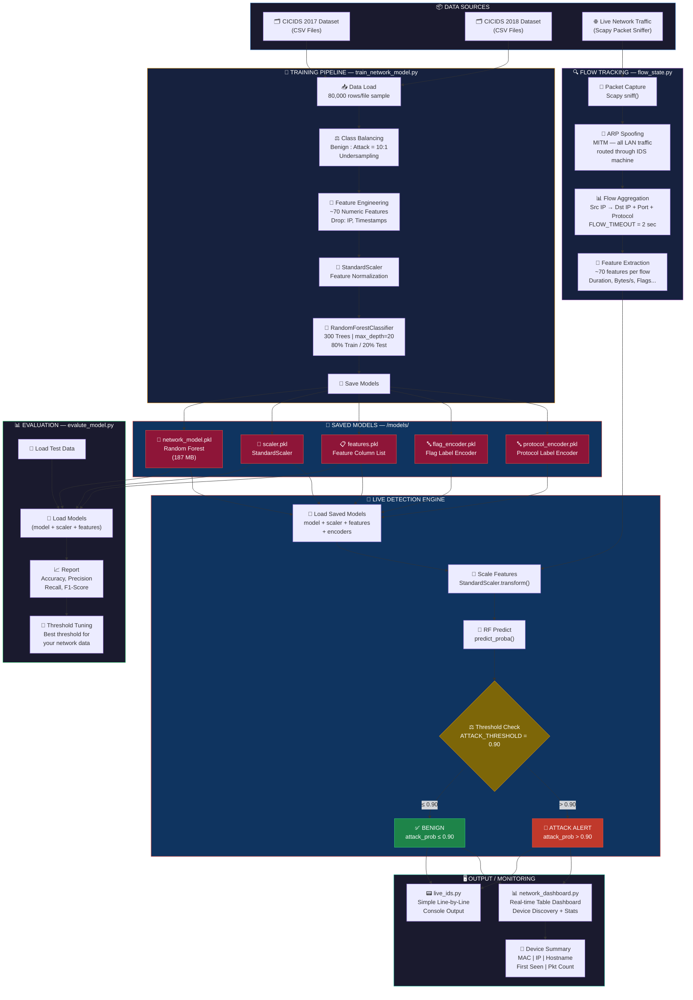
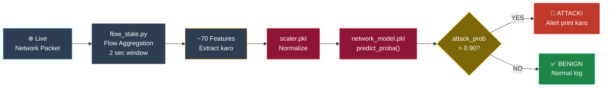
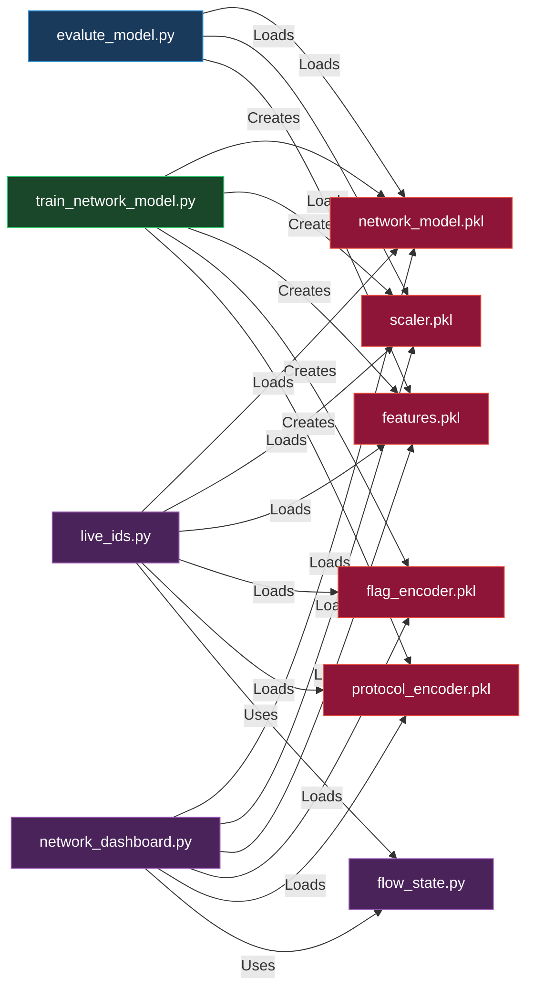

# 🛡️ NetGuardIDS

A real-time, ML-powered **Network Intrusion Detection System** that monitors your entire LAN for malicious traffic using a trained Random Forest classifier, ARP spoofing (MITM), and live packet capture via Scapy.

---

## 📑 Table of Contents

- [Overview](#overview)
- [Architecture](#architecture)
- [Project Structure](#project-structure)
- [How It Works](#how-it-works)
- [Model's Role in the IDS](#models-role-in-the-ids)
- [Installation & Requirements](#installation--requirements)
- [Quick Start](#quick-start)
- [Script Reference](#script-reference)
  - [live_ids.py](#live_idspy) — Main live IDS (recommended)
  - [network_dashboard.py](#network_dashboardpy) — Rich visual dashboard
  - [train_network_model.py](#train_network_modelpy) — Model training
  - [evaluate_model.py](#evalute_modelpy) — Model evaluation
  - [flow_state.py](#flow_statepy) — Flow tracking engine
  - [capture_packets.py](#capture_packetspy) — Legacy capture script
  - [train_ids.py](#train_idspy) — Legacy simple IDS
  - [pcap_to_flow.py](#pcap_to_flowpy) — PCAP to CSV converter
- [Configuration Reference](#configuration-reference)
- [Model Workflow](#model-workflow)
- [Model Details](#model-details)
- [Feature Reference](#feature-reference)
- [Datasets](#datasets)
- [Saved Model Files](#saved-model-files)
- [ARP Spoofing (MITM)](#arp-spoofing-mitm)
- [Threshold Tuning](#threshold-tuning)
- [Troubleshooting](#troubleshooting)

---

## Overview

This IDS works at the **network flow level** — not packet-by-packet. It:

1. **Captures** all LAN traffic by placing the IDS machine as a MITM via ARP spoofing.
2. **Groups** packets into flows (by `src_ip → dst_ip + port + protocol`).
3. **Extracts** ~70 statistical features from each completed flow.
4. **Predicts** whether the flow is `BENIGN` or `ATTACK` using a trained Random Forest model.
5. **Displays** results in real-time — either as scrolling log lines or a live terminal dashboard.

**Attack types it was trained on:**  
DDoS, Brute Force (SSH/FTP), SQL Injection, XSS, Bot, Port Scan, Web Attacks, DoS, Infiltration, and more — sourced from the CICIDS 2017 and 2018 benchmark datasets.

---

## Architecture

```
┌─────────────────────────────────────────────────────────────────┐
│                        Network Devices (LAN)                    │
│  [PC]   [Laptop]   [Phone]   [IoT Device]   [Smart TV] ...     │
└────────────────────────┬────────────────────────────────────────┘
                         │  (All traffic redirected via ARP Spoof)
                         ▼
┌─────────────────────────────────────────────────────────────────┐
│                     IDS Machine (This PC)                       │
│                                                                 │
│  ┌──────────────┐   ┌─────────────────┐   ┌─────────────────┐  │
│  │  ARP Spoof   │   │  Packet Capture │   │  Hostname       │  │
│  │  Loop Thread │   │  (Scapy sniff)  │   │  Resolver       │  │
│  └──────┬───────┘   └────────┬────────┘   └────────┬────────┘  │
│         │                   │                      │            │
│         │              ┌────▼──────────────────┐   │            │
│         │              │    FlowState Engine   │   │            │
│         │              │  (flow_state.py)      │   │            │
│         │              │  Tracks per-flow stats│   │            │
│         │              └────────────┬──────────┘   │            │
│         │                          │               │            │
│         │              ┌───────────▼─────────────┐ │            │
│         │              │  Prediction Queue       │ │            │
│         │              │  (Async background)     │ │            │
│         │              └───────────┬─────────────┘ │            │
│         │                          │               │            │
│         │              ┌───────────▼─────────────┐ │            │
│         └──────────────►  Random Forest Model    │ │            │
│                        │  (network_model.pkl)    ◄──┘            │
│                        └───────────┬─────────────┘              │
│                                    │                            │
│                ┌───────────────────▼───────────────────────┐    │
│                │  Output: Console Log  /  Rich Dashboard   │    │
│                └───────────────────────────────────────────┘    │
└─────────────────────────────────────────────────────────────────┘
```

---

## Project Structure

```
ids model/
│
├── README.md                   ← This documentation
├── model_guide.md              ← Legacy quick-reference (Hindi/English)
│
├── data/                       ← Training datasets (CSV files)
│   ├── Friday-WorkingHours-*.csv      (CICIDS 2017)
│   ├── Monday-WorkingHours.csv
│   ├── Tuesday-WorkingHours.csv
│   ├── Wednesday-workingHours.csv
│   ├── Thursday-WorkingHours-*.csv
│   ├── Friday-02-03-2018.csv          (CIC-IDS-2018)
│   ├── Thursday-22-02-2018.csv
│   ├── CTU13_Attack_Traffic.csv
│   ├── final_dataset.csv              (merged, pre-processed)
│   └── ...
│
├── models/                     ← Saved trained model artifacts
│   ├── network_model.pkl       ← Trained Random Forest classifier
│   ├── scaler.pkl              ← StandardScaler (fitted on training data)
│   ├── features.pkl            ← Feature column list
│   ├── flag_encoder.pkl        ← (Legacy) Label encoder for flags
│   └── protocol_encoder.pkl    ← (Legacy) Label encoder for protocol
│
└── scripts/                    ← All Python scripts
    ├── live_ids_auto.py        ← ★ MAIN: Universal multi-interface IDS
    ├── live_ids.py             ← Legacy Ethernet-only IDS
    ├── live_ids_wifi.py        ← Wi-Fi variant of live_ids.py
    ├── network_dashboard.py    ← Rich terminal dashboard (visual mode)
    ├── flow_state.py           ← Core flow tracking engine (shared module)
    ├── train_network_model.py  ← Train the Random Forest model
    ├── evaluate_model.py        ← Evaluate model accuracy + threshold sweep
    ├── capture_packets.py      ← Legacy basic capture script
    ├── train_ids.py            ← Legacy simple IDS (no ARP spoof)
    ├── pcap_to_flow.py         ← Convert PCAP→ flow CSV
    ├── pcap_to_dataset.py      ← Convert PCAP→ training dataset CSV
    ├── generate_dataset.py     ← Dataset generation helper
    ├── test_flow_phase1.py     ← Unit test for flow feature extraction
    └── benign_traffic.pcap     ← Sample benign traffic capture file
```

---

## How It Works

### 1. Interface Selection (Auto-detect)

`live_ids.py` automatically selects the best network interface using a 3-step priority system:

1. **`netifaces` (most reliable)** — reads the OS routing table to find the default gateway interface, then constructs the Scapy NPF path directly.
2. **IP-based heuristic** — iterates all interfaces, skips loopback (`127.*`), APIPA (`169.254.*`), VirtualBox/VMware host-only subnets, and prefers Ethernet over Wi-Fi.
3. **Scapy default fallback** — uses `conf.iface` as a last resort.

You can also force a specific interface by setting `INTERFACE = "\\Device\\NPF_{YOUR-GUID}"` at the top of the script.

---

### 2. ARP Scanning (Active Network Discovery)

On startup, an ARP broadcast is sent to the entire `/24` subnet to discover all live hosts. This populates the `discovered_ips` table.

A background thread re-scans every **60 seconds** to pick up newly joined devices.

---

### 3. ARP Spoofing (MITM — Full Network Capture)

To see traffic between *other* devices on the LAN (not just your own machine's packets), ARP spoofing is used:

- **Tell every LAN device:** "The gateway's MAC = my MAC" → all outbound traffic comes to the IDS machine.
- **Tell the gateway:** "Every device's MAC = my MAC" → all inbound traffic also passes through.
- **Windows IP forwarding** is enabled so the IDS machine actually forwards packets (doesn't kill connectivity).

On `Ctrl+C`, ARP tables are **restored** and IP forwarding is **disabled** automatically.

---

### 4. Flow Tracking (`flow_state.py`)

Each unique 5-tuple `(src_ip, dst_ip, src_port, dst_port, protocol)` is tracked as a `FlowState` object. The flow accumulates:
- Packet counts (forward and backward)
- Byte totals
- Inter-arrival times (IAT statistics)
- TCP flag counts (SYN, ACK, FIN, RST, PSH, URG, CWE, ECE)
- Packet length statistics (min, max, mean, std)
- Window sizes, header lengths, active/idle time

When a flow exceeds `FLOW_TIMEOUT` seconds, it is closed, features are extracted, and it is sent to the prediction queue.

---

### 5. Asynchronous Prediction

Predictions run in a **separate background thread** so that the Scapy packet capture loop is never blocked. Completed flows are enqueued into a `Queue(maxsize=500)`.

The prediction worker:
1. Pops a `(features, meta)` tuple from the queue.
2. Aligns feature names to match the scaler's expected column order.
3. Scales features using `StandardScaler`.
4. Calls `model.predict_proba()` to get `[benign_prob, attack_prob]`.
5. Prints the result with label, probability, source/destination, port, protocol, and LAN/WAN direction.

---

### 6. Output

**`live_ids.py`** — plain text line output:
```
[12:05:33]    BENIGN  (0.07) | 192.168.1.45 (aa:bb:cc:...) -> 8.8.8.8 | Port 443 | TCP | LAN->WAN
[12:05:34] !! ATTACK  (0.94) | 192.168.1.22 (dd:ee:ff:...) -> 192.168.1.1 | Port 22 | TCP | LAN->LAN
```

**`network_dashboard.py`** — Rich live terminal table showing all devices, their status, attack probability, port, protocol, and traffic direction, updated every second.

---

## Model's Role in the IDS

The machine learning model is the **brain** of the IDS. Everything else — packet capture, ARP spoofing, flow tracking — exists solely to feed the model clean, structured input. Here is a detailed breakdown of exactly what the model does, when it runs, and how it makes decisions.

---

### What Problem Does the Model Solve?

Traditional IDS tools use **rule-based signatures** — fixed patterns like "if a packet has these exact bytes, it's an attack". This approach fails against:
- New or modified attacks that don't match known signatures.
- Encrypted traffic where payload content cannot be inspected.
- Slow/distributed attacks that look normal packet-by-packet.

This IDS uses a **machine learning model** instead. Rather than looking at the content of packets, it looks at **statistical behaviour** of entire flows — timing patterns, byte rates, flag ratios. A DDoS flood, a port scan, and a brute force all have distinctive statistical fingerprints that the model has learned to recognise from ~2 million real-world labelled samples.

---

### What Does the Model NOT Do?

| It does NOT | Instead |
|---|---|
| Inspect packet payload / content | Analyses only statistical metadata |
| Block traffic | Only detects and alerts |
| Act in real-time per-packet | Works per-flow (after `FLOW_TIMEOUT` seconds) |
| Know which specific attack type it is | Binary only: BENIGN or ATTACK |
| Update itself during live monitoring | Frozen after training — static model |

---

### Model Type: Random Forest Classifier

A **Random Forest** is an ensemble of 300 independent Decision Trees. Each tree independently votes `BENIGN` or `ATTACK`. The final output is the **fraction of trees that voted ATTACK** — this is the `attack_probability` (a value between 0.0 and 1.0).

```
  Flow Features
       │
       ├──► Tree  1  →  BENIGN
       ├──► Tree  2  →  ATTACK
       ├──► Tree  3  →  ATTACK
       ├──► Tree  4  →  BENIGN
       │        ...  (300 total)
       └──► Tree  300 → ATTACK

  ATTACK votes = 240 / 300 = 0.80  →  attack_probability = 0.80
  Threshold = 0.40  →  0.80 > 0.40  →  !! ATTACK
```

Random Forest was chosen because:
- It handles non-linear patterns in network traffic well.
- It is robust to noisy features and outliers.
- It natively provides calibrated probabilities via `predict_proba()`.
- It can be trained on large tabular datasets efficiently.
- It is interpretable (feature importances can be inspected).

---

### Where in the Pipeline Does the Model Run?

```
Packet arrives
    │
    ▼
Scapy sniff() → process_packet()
    │
    ├── ARP packet? → learn MAC, skip
    │
    ├── Not IP? → skip
    │
    ├── Multicast/broadcast? → skip
    │
    ▼
FlowState.update()       ← Add packet to its flow
    │
    ├── Flow duration < FLOW_TIMEOUT? → wait for more packets
    │
    ▼
FlowState.build_basic_features()  ← Extract ~68 features
    │
    ▼
prediction_queue.put((features, meta))   ← Enqueue for background worker
    │
    ▼
[Background Thread] prediction_worker()
    │
    ▼
predict_flow(features, meta)
    │
    ├── Align feature dict to COLUMN_ORDER
    ├── pd.DataFrame([aligned])    ← Named columns (avoids sklearn warning)
    ├── scaler.transform(df)       ← Normalise with StandardScaler
    └── model.predict_proba(scaled)[0][1]  ← Get attack probability
            │
            ├── prob > ATTACK_THRESHOLD  →  print ATTACK
            └── prob ≤ ATTACK_THRESHOLD  →  print BENIGN
```

> The model runs **off the main capture thread** — in a background worker — so packet capture latency is never affected by model inference time.

---

### What the Model Has Learned to Detect

The model was trained on labelled flows from CICIDS 2017, CIC-IDS 2018, and CTU-13. Below is what statistical patterns each attack type leaves behind that the model picks up:

| Attack Type | Key Statistical Signal |
|---|---|
| **DDoS / DoS** | Extremely high `Flow Pkts/s` and `SYN Flag Cnt`; very short `Flow Duration`; tiny `Fwd Pkt Len Mean` |
| **SYN Flood** | `SYN Flag Cnt` >> `ACK Flag Cnt`; high `SYN Rate`; `Flow Duration` near zero |
| **Port Scan** | High `RST Flag Cnt`; many unique `Dst Port` values; very short flows; high `RST Rate` |
| **Brute Force (SSH/FTP)** | Many flows to same port (22/21); repeated connection attempts; low `Down/Up Ratio` |
| **Web Attacks (SQLi, XSS)** | HTTP port (80/443); unusual `Fwd Pkt Len` spikes; low `Tot Bwd Pkts` |
| **Botnet** | Periodic flows; regular `Flow IAT Mean`; consistent small packet sizes |
| **Infiltration** | Anomalous `Init Fwd Win Byts`; large backward transfers (`TotLen Bwd Pkts`) |

---

### Prediction Input: Feature Alignment

A critical step before prediction is **feature alignment**. The scaler was fitted on a specific list of feature columns during training (stored in `scaler.feature_names_in_`). The live flow must present features in exactly the same order with the same names:

```python
# In predict_flow():
COLUMN_ORDER = list(scaler.feature_names_in_)   # loaded once at startup

# For each flow at prediction time:
aligned = {col: float(features.get(col, 0)) for col in COLUMN_ORDER}
# Any feature missing in the flow is filled with 0.0 (safe default)

df = pd.DataFrame([aligned])      # Named DataFrame — avoids sklearn warnings
scaled = scaler.transform(df)     # Z-score normalise each feature
prob = model.predict_proba(scaled)[0][1]   # Index [1] = attack class probability
```

**Why StandardScaler?** Random Forest is tree-based and technically doesn't need scaling, but the scaler was applied during training, so it must also be applied at inference to keep the feature distributions identical. Skipping it would produce wrong predictions.

---

### Prediction Output Interpretation

```
model.predict_proba(X)  →  [benign_prob, attack_prob]
                              e.g. [0.08,      0.92]
```

| `attack_prob` Value | Meaning |
|---|---|
| `0.00 – 0.10` | Very likely benign — routine traffic |
| `0.10 – 0.39` | Probably benign — minor anomaly |
| `0.40 – 0.69` | Suspicious — watch this IP |
| `0.70 – 0.89` | Likely attack — consider investigating |
| `0.90 – 1.00` | High-confidence attack |

The `ATTACK_THRESHOLD` in the settings is the line that separates `!! ATTACK` from `BENIGN` in the printed output. You can tune this value — lower values catch more attacks but produce more false positives.

---

### Training vs Inference Summary

| Phase | Script | What Happens |
|---|---|---|
| **Training** | `train_network_model.py` | Reads CSVs, extracts features, fits scaler, trains 300-tree forest, saves `.pkl` files |
| **Inference (Live)** | `live_ids.py` | Loads `.pkl` files at startup, runs `predict_proba()` on each completed flow |
| **Evaluation** | `evaluate_model.py` | Loads `.pkl` files, runs predictions on a held-out CSV, shows accuracy + threshold sweep |

The model is **frozen at training time**. It does not learn from live traffic. To improve it, retrain `train_network_model.py` with more data.

---

## Installation & Requirements

### Prerequisites

- Python 3.8+
- [Npcap](https://npcap.com/) installed (Windows packet capture driver — **required**)
- Run scripts as **Administrator** on Windows (raw sockets require elevated privileges)

### Install Dependencies

```bash
pip install scapy joblib pandas numpy scikit-learn rich netifaces
```

> **Note:** `netifaces` is optional but strongly recommended for reliable gateway detection on Windows. Without it, the system falls back to parsing `route print` output.

---

## Quick Start

### First-Time Setup (Train the Model)

Only needed once. Skip if `models/network_model.pkl` already exists.

```bash
# From the project root — must have CSV files in data/
python scripts/train_network_model.py
```

Expected output: accuracy report + `model saved successfully!`

---

### Run Live IDS (Recommended)

```bash
# Run as Administrator!
python scripts/live_ids_auto.py
```

Output:
```
=================================================================
[NetGuardIDS] Live IDS Started -- Full Network Discovery Mode
   Model expects 68 features
=================================================================
[*] Auto-selected via routing table : \Device\NPF_{...}  (IP: 192.168.1.100, GW: 192.168.1.1)
[*] Mode        : Full Ethernet Network
[*] Interface   : \Device\NPF_{...}
[*] Threshold   : 0.40
[*] Flow Timeout: 1s
...
[12:00:01]    BENIGN  (0.03) | 192.168.1.5 -> 8.8.8.8 | Port 443 | TCP | LAN->WAN
```

Press `Ctrl+C` to stop — ARP tables will be restored automatically.

---

### Run Visual Dashboard

```bash
# Run as Administrator!
python scripts/network_dashboard.py
```

A full-screen Rich table shows all discovered devices with color-coded attack status.

---

### Evaluate Model Performance

```bash
python scripts/evaluate_model.py
```

Outputs accuracy, classification report, confusion matrix, and a threshold sweep table to find the optimal detection threshold.

---

## Script Reference

---

### `live_ids.py`

**Main production IDS script.** Full network monitoring with ARP spoofing, async prediction, and device discovery.

**Key functions:**

| Function | Description |
|---|---|
| `pick_interface()` | Auto-detects the best network interface using netifaces → IP heuristics → Scapy default |
| `arp_scan(subnet, iface)` | Sends ARP broadcast to discover all LAN hosts |
| `periodic_arp_scan(subnet, iface, interval)` | Background thread: re-scans every N seconds |
| `get_gateway_ip(local_ip)` | Reads routing table (netifaces or `route print`) to find the real gateway |
| `get_mac(ip, iface)` | ARP-resolves an IP to its MAC address |
| `get_own_mac(iface)` | Gets this machine's MAC directly from the interface |
| `enable_ip_forwarding()` | Enables Windows IP forwarding via netsh + registry |
| `disable_ip_forwarding()` | Disables IP forwarding on exit |
| `arp_spoof_loop(iface)` | Continuously poisons ARP caches of all discovered devices and the gateway |
| `stop_arp_spoof(iface)` | Restores all ARP tables and disables IP forwarding |
| `process_packet(pkt)` | Called by Scapy for every captured packet; updates flows, registers devices |
| `handle_arp(pkt)` | Learns IP→MAC mappings from passive ARP observation |
| `prediction_worker()` | Background thread: pops flows from queue and runs model prediction |
| `predict_flow(features, meta)` | Scales features and calls `model.predict_proba()` |
| `hostname_worker()` | Background thread: resolves IPs to hostnames via reverse DNS |
| `register_device(ip, mac)` | Tracks a discovered device in `discovered_ips` |
| `cleanup_stale_flows()` | Removes flows not updated in 30+ seconds |
| `print_device_summary()` | Prints a summary table of all seen devices on exit |

**Key settings at top of file:**

```python
ATTACK_THRESHOLD = 0.40    # Probability cutoff for ATTACK label
FLOW_TIMEOUT     = 1       # Seconds before a flow is considered complete
DEVICE_ONLY_MODE = False   # True = only this machine's traffic; False = full LAN
INTERFACE        = None    # None = auto-detect; or set to NPF GUID string
ARP_SCAN_SUBNET  = None    # None = auto from interface; or "192.168.1.0/24"
ARP_SPOOF_ENABLED = True   # Set False to disable MITM (capture own traffic only)
```

---

### `network_dashboard.py`

**Rich terminal dashboard.** Shows a live-updating table of all LAN devices with ML prediction status.

**Dashboard columns:**

| Column | Meaning |
|---|---|
| `#` | Row number |
| `IP Address` | Source IP (red = attacking, yellow = active traffic, white = discovered only) |
| `MAC` | MAC address from ARP/Ethernet layer |
| `Status` | `ATTACK` / `ACTIVE` / `DISCOVERED` |
| `Atk %` | Attack probability as percentage |
| `Port` | Destination port of latest classified flow |
| `Proto` | `TCP` / `UDP` |
| `Direction` | `LAN->LAN`, `LAN->WAN`, `WAN->LAN` |
| `Attacks` | Total flows classified as attack from this IP |
| `Flows` | Total flows seen from this IP |
| `Last Seen` | Time of most recent activity |

**Key settings:**

```python
ATTACK_THRESHOLD = 0.90    # Higher than live_ids.py (stricter for visual clarity)
FLOW_TIMEOUT     = 2       # Seconds per flow
REFRESH_RATE     = 1       # Dashboard refresh interval (seconds)
ARP_RESCAN_SECS  = 60      # Background ARP rescan interval
SHOW_PRIVATE     = True    # Show LAN IPs
SHOW_PUBLIC      = True    # Show WAN (internet) IPs
```

> **Note:** Dashboard runs packet sniffing in a background thread and updates the display in the main thread using `rich.live.Live`. Press `Ctrl+C` to stop and see a summary.

---

### `train_network_model.py`

**One-time model training script.** Reads all CSVs in `data/`, samples, balances, trains a Random Forest, and saves the model artifacts.

**Training pipeline:**

| Step | Action | Details |
|---|---|---|
| 1 | **Load** | Reads all `.csv` files from `data/`, samples up to 80,000 rows per file |
| 2 | **Normalize** | Maps 2017 column names → 2018 format (e.g. `Destination Port` → `Dst Port`) |
| 3 | **Clean** | Drops IP/timestamp columns, replaces `inf`/`NaN` |
| 4 | **Balance** | Undersamples benign traffic to `attack_count × 10` (realistic ratio) |
| 5 | **Scale** | `StandardScaler` fit on training data |
| 6 | **Split** | 80% train / 20% test |
| 7 | **Train** | `RandomForestClassifier(n_estimators=300, max_depth=20, min_samples_leaf=5)` |
| 8 | **Evaluate** | Prints accuracy + classification report on test set |
| 9 | **Save** | Saves `network_model.pkl`, `scaler.pkl`, `features.pkl` to `models/` |

**Key settings:**

```python
SAMPLE_PER_FILE = 80000       # Max rows to load per CSV file
DROP_COLUMNS    = ["Flow ID", "Src IP", "Dst IP", "Timestamp", "Src Port"]
TEST_SIZE       = 0.2         # 20% held out for evaluation
```

---

### `evaluate_model.py`

**Standalone model evaluation.** Tests a saved model on a held-out dataset and performs a threshold sweep.

**Output includes:**

1. **Default threshold (0.5):** Accuracy, full classification report, confusion matrix.
2. **Confusion matrix breakdown:**
   - True Negatives (benign correctly identified)
   - False Positives (benign flagged as attack)
   - False Negatives (attacks missed)
   - True Positives (attacks correctly caught)
3. **Threshold sweep table:** Tests thresholds `[0.5, 0.4, 0.3, 0.2, 0.15, 0.1, 0.05]` showing detection rate, false alarm rate, precision, and F1 score. Marks the best threshold automatically.

**Usage:**

```bash
python scripts/evaluate_model.py
```

> Edit `DATA_PATH` at the top to point to a different test CSV. Default is `Thursday-22-02-2018.csv`.

---

### `flow_state.py`

**Core shared module** — imported by `live_ids.py`, `network_dashboard.py`, `train_ids.py`, and `capture_packets.py`.

Tracks a single network flow's statistics as packets arrive.

**Class: `FlowState`**

| Method | Description |
|---|---|
| `__init__(key, first_packet)` | Initialises all counters, timestamps, and processes the first packet |
| `update(packet)` | Updates all counters for each new packet in the flow |
| `flow_duration()` | Returns elapsed seconds since flow start |
| `compute_stats(arr)` | Returns `(mean, std, max, min)` for a list of values |
| `compute_iat_stats(timestamps)` | Returns `(mean, std, max, min, total)` of inter-arrival times |
| `build_basic_features()` | Returns a `dict` of all ~68 features ready for model input |

**Features tracked:**
- Packet counts per direction (forward/backward)
- Byte totals per direction
- Packet length statistics (min, max, mean, std, var) per direction
- Flow IAT (inter-arrival time) statistics
- Forward/backward IAT statistics
- TCP window sizes (`init_fwd_win_bytes`, `init_bwd_win_bytes`)
- TCP flags: FIN, SYN, RST, PSH, ACK, URG, CWE, ECE
- Header lengths
- Active/idle time periods
- Flow bytes/s, packets/s (per direction)
- Subflow statistics
- Unique destination ports
- Down/Up ratio

---

### `capture_packets.py`

**Legacy basic capture script.** Earlier version of `live_ids.py` — simpler feature extraction (11 features), no ARP spoofing, no device discovery, no async prediction.

Kept for reference. Use `live_ids.py` for production.

---

### `train_ids.py`

**Legacy simple IDS.** An earlier version that uses `FlowState` but has no ARP spoofing, no device tracking, no async prediction queue. Stops/blocks on prediction.

Kept for reference. Use `live_ids.py` for production.

---

### `pcap_to_flow.py`

**Utility script.** Reads a `.pcap` file, extracts flows using the same 5-tuple method, and writes a CSV with all flow features to `data/benign_live1.csv`. Useful for generating benign baseline datasets from captured traffic.

**Usage:**
```bash
# Edit PCAP_PATH and OUTPUT_PATH at top of script, then:
python scripts/pcap_to_flow.py
```

---

## Configuration Reference

All settings live at the **top of each script** and are clearly labelled.

### `live_ids.py` Settings

| Setting | Type | Default | Description |
|---|---|---|---|
| `ATTACK_THRESHOLD` | `float` | `0.40` | Minimum attack probability to trigger alert |
| `FLOW_TIMEOUT` | `int` | `1` | Seconds before a flow is finalized and sent for prediction |
| `DEVICE_ONLY_MODE` | `bool` | `False` | `True` = monitor only this machine; `False` = entire LAN |
| `INTERFACE` | `str\|None` | `None` | Force a specific NPF interface GUID, or `None` for auto-detect |
| `ARP_SCAN_SUBNET` | `str\|None` | `None` | Override ARP scan subnet (e.g. `"192.168.1.0/24"`) |
| `ARP_SPOOF_ENABLED` | `bool` | `True` | Enable/disable ARP spoofing (MITM) |

### `network_dashboard.py` Settings

| Setting | Type | Default | Description |
|---|---|---|---|
| `ATTACK_THRESHOLD` | `float` | `0.90` | Alert threshold |
| `FLOW_TIMEOUT` | `int` | `2` | Seconds per flow |
| `DEVICE_ONLY_MODE` | `bool` | `False` | Monitor mode |
| `INTERFACE` | `str\|None` | `None` | Force interface |
| `REFRESH_RATE` | `int` | `1` | Dashboard refresh interval (seconds) |
| `ARP_RESCAN_SECS` | `int` | `60` | Background ARP re-scan interval |
| `SHOW_PRIVATE` | `bool` | `True` | Show private/LAN IPs |
| `SHOW_PUBLIC` | `bool` | `True` | Show public/WAN IPs |

### `train_network_model.py` Settings

| Setting | Type | Default | Description |
|---|---|---|---|
| `SAMPLE_PER_FILE` | `int` | `80000` | Max rows sampled per CSV during training |
| `TEST_SIZE` | `float` | `0.2` | Fraction of data held out for testing |
| `RANDOM_STATE` | `int` | `42` | Random seed for reproducibility |

---

## Model Workflow

This section shows the **complete end-to-end workflow** of the model — from raw data to a live alert — split into two distinct phases.

---

### Phase 1 — Offline Training (run once)

```
┌─────────────────────────────────────────────────────────────┐
│              train_network_model.py                         │
└─────────────────────────────────────────────────────────────┘

  data/ folder
  ┌──────────────────────────────────────┐
  │  CICIDS2017 CSVs  (8 files)          │
  │  CIC-IDS2018 CSVs (8 files)          │
  │  CTU-13 CSV       (1 file)           │
  └──────────────────┬───────────────────┘
                     │  read + sample (80,000 rows / file)
                     ▼
          ┌──────────────────────┐
          │  normalize columns   │  ← 2017 names → 2018 names
          │  drop IP/timestamps  │
          │  fix inf / NaN       │
          └──────────┬───────────┘
                     │
                     ▼
          ┌──────────────────────┐
          │  Label → Binary      │  BENIGN=0 / anything else=1
          │  Balance classes     │  benign ≤ attack × 10
          └──────────┬───────────┘
                     │
                     ▼
          ┌──────────────────────┐
          │  StandardScaler      │  fit on training features
          │  .fit_transform(X)   │  → Z-score normalise
          └──────────┬───────────┘
                     │
                     ▼
          ┌──────────────────────┐
          │  train / test split  │  80% train  /  20% test
          └──────────┬───────────┘
                     │
                     ▼
          ┌──────────────────────────────────────────┐
          │  RandomForestClassifier                  │
          │    n_estimators = 300                    │
          │    max_depth    = 20                     │
          │    class_weight = "balanced"             │
          │  .fit(X_train, y_train)                  │
          └──────────┬───────────────────────────────┘
                     │
                     ▼
          ┌──────────────────────┐
          │  Evaluate on X_test  │  → accuracy, precision,
          │                      │    recall, F1 printed
          └──────────┬───────────┘
                     │
                     ▼
          ┌──────────────────────────────────────┐
          │  models/network_model.pkl  (187 MB)  │  ← trained forest
          │  models/scaler.pkl         (~4 KB)   │  ← fitted scaler
          │  models/features.pkl       (~1 KB)   │  ← column order
          └──────────────────────────────────────┘
```

---

### Phase 2 — Live Inference (runs continuously)

```
┌─────────────────────────────────────────────────────────────┐
│                  live_ids.py  (startup)                     │
└─────────────────────────────────────────────────────────────┘

  models/
  ├── network_model.pkl  ──┐
  ├── scaler.pkl          ─┼──► joblib.load() → loaded into RAM
  └── features.pkl        ──┘   (done once at startup)

         │
         ▼
  Interface auto-detected  →  ARP scan  →  Gateway MAC found
  IP Forwarding enabled    →  ARP Spoof loop started (background)

         │
         ▼ (main loop — runs forever until Ctrl+C)
  ┌──────────────────────────────────────────────────────────┐
  │                  Scapy sniff()                           │
  │            promisc=True, store=False                     │
  └──────────────────────┬───────────────────────────────────┘
                         │ every packet
                         ▼
               process_packet(pkt)
                         │
          ┌──────────────┼───────────────┐
          │              │               │
       ARP?           Not IP?       Multicast?
          │              │               │
     learn MAC        skip           skip
     table; return
          │
          ▼  (IP packet continues)
   get_key(pkt)  →  (src_ip, dst_ip, sport, dport, proto)
          │
          ▼
   FlowState dict  ──► existing key?
          │                   │
        [YES]               [NO]
          │                   │
   .update(pkt)      FlowState(key, pkt)   ← new flow created
          │
          ▼
   flow.flow_duration() > FLOW_TIMEOUT?
          │
        [NO] ──► wait, accumulate more packets
          │
        [YES]
          │
          ▼
   FlowState.build_basic_features()
   returns dict of ~68 features:
   {
     "Flow Duration":  ...,
     "SYN Flag Cnt":   ...,
     "Flow Pkts/s":    ...,
     "Init Fwd Win Byts": ...,
     ...68 total...
   }
          │
          ▼
   prediction_queue.put((features, meta))
   del flows[key]   ← flow closed
          │
          │  (enqueued — main thread returns immediately to sniff)
          │
          ▼  [Background Thread]
   prediction_worker()  dequeues item
          │
          ▼
   predict_flow(features, meta)
          │
          ├── aligned = {col: features.get(col, 0)
          │              for col in COLUMN_ORDER}
          │
          ├── df = pd.DataFrame([aligned])
          │         (named columns → no sklearn warning)
          │
          ├── scaled = scaler.transform(df)
          │         (Z-score normalise using fitted scaler)
          │
          └── prob = model.predict_proba(scaled)[0][1]
                    ↑ array index [1] = attack class probability

                         │
          ┌──────────────┴──────────────┐
          │                             │
   prob > ATTACK_THRESHOLD        prob ≤ ATTACK_THRESHOLD
          │                             │
  !! ATTACK  (prob)              BENIGN  (prob)
  src_ip → dst_ip               src_ip → dst_ip
  Port | Proto | Direction       Port | Proto | Direction
          │
          ▼  (on Ctrl+C)
  stop_arp_spoof()  →  restore all ARP tables
  disable_ip_forwarding()
  print_device_summary()
```

---

### Data Flow Summary Table

| Stage | Input | Process | Output |
|---|---|---|---|
| **Data Load** | CSV files | Read + sample | Raw DataFrames |
| **Cleaning** | Raw DataFrames | Drop cols, fix NaN/inf | Clean DataFrames |
| **Labelling** | `Label` column | `"BENIGN"→0`, else→1 | Binary `y` vector |
| **Balancing** | `y` vector | Undersample benign | Balanced dataset |
| **Scaling** | Feature matrix `X` | `StandardScaler.fit_transform()` | Normalised `X_scaled` |
| **Training** | `X_scaled`, `y` | `RandomForest.fit()` | Trained model (300 trees) |
| **Saving** | Trained objects | `joblib.dump()` | `.pkl` files |
| **Loading** (live) | `.pkl` files | `joblib.load()` | Model + scaler in RAM |
| **Packet Capture** | Network interface | `scapy.sniff()` | Raw packets |
| **Flow Building** | Raw packets | `FlowState.update()` | Per-flow statistics |
| **Feature Extraction** | FlowState | `build_basic_features()` | Feature dict (68 keys) |
| **Alignment** | Feature dict | Match `COLUMN_ORDER` | Aligned dict → DataFrame |
| **Normalisation** | DataFrame | `scaler.transform()` | Scaled array |
| **Prediction** | Scaled array | `model.predict_proba()` | `[benign_prob, attack_prob]` |
| **Alert** | `attack_prob` | Compare to `ATTACK_THRESHOLD` | `BENIGN` or `!! ATTACK` |

---

### Key Decision Points

```
Decision 1 — Which interface to use?
  └── netifaces gateway iface available?  YES → use it
      └── routable non-APIPA IP found?    YES → use it
          └── fallback to conf.iface

Decision 2 — Should this packet be processed?
  ├── ARP?         → learn MAC, skip prediction
  ├── No IP layer? → skip
  └── Multicast/broadcast dst? → skip

Decision 3 — Is the flow ready for prediction?
  └── flow_duration() > FLOW_TIMEOUT?
      NO  → accumulate more packets
      YES → extract features, enqueue, close flow

Decision 4 — Is this an attack?
  └── attack_prob > ATTACK_THRESHOLD?
      YES → print ATTACK alert
      NO  → print BENIGN
```

---

## Model Details

### Algorithm

**Random Forest Classifier** from scikit-learn.

```python
RandomForestClassifier(
    n_estimators   = 300,      # 300 decision trees
    max_depth      = 20,       # Max tree depth (limits overfitting)
    min_samples_split = 5,
    min_samples_leaf  = 5,     # Min samples at leaf (improves generalisation)
    class_weight   = "balanced",  # Handles class imbalance automatically
    n_jobs         = -1,       # Use all CPU cores
)
```

### Prediction

- **Input:** ~68 network flow features (standardised with `StandardScaler`)
- **Output:** `[benign_probability, attack_probability]`

```
If attack_prob >  ATTACK_THRESHOLD  →  ATTACK  !!
If attack_prob <= ATTACK_THRESHOLD  →  BENIGN
```

### Training Data

| Source | Type | Coverage |
|---|---|---|
| CICIDS 2017 | Benchmark | Mon–Fri traffic, DDoS, PortScan, Web Attacks, etc. |
| CIC-IDS 2018 | Benchmark | DDoS, Brute Force, Infiltration, Botnet, etc. |
| CTU-13 | Botnet | Botnet traffic scenarios |

Up to **80,000 rows sampled per CSV file**. Benign traffic is undersampled to `attack_count × 10` for a realistic class ratio.

### Binary Labels

| Label | Value | Meaning |
|---|---|---|
| `BENIGN` | `0` | Normal / safe traffic |
| Any attack name | `1` | Malicious traffic |

---

## Feature Reference

The model uses ~68 features computed by `FlowState.build_basic_features()`:

### Flow-Level

| Feature | Description |
|---|---|
| `Dst Port` | Destination port number |
| `Protocol` | IP protocol number (6=TCP, 17=UDP) |
| `Flow Duration` | Total flow duration in seconds |

### Packet Counts

| Feature | Description |
|---|---|
| `Tot Fwd Pkts` | Total forward (sender→receiver) packets |
| `Tot Bwd Pkts` | Total backward (receiver→sender) packets |
| `TotLen Fwd Pkts` | Total forward bytes |
| `TotLen Bwd Pkts` | Total backward bytes |
| `Total Packets` | All packets combined |
| `Total Bytes` | All bytes combined |
| `Unique Dst Ports` | Number of unique destination ports in flow |

### Packet Length Statistics

| Feature | Description |
|---|---|
| `Fwd Pkt Len Max/Min/Mean/Std` | Forward packet length statistics |
| `Bwd Pkt Len Max/Min/Mean/Std` | Backward packet length statistics |
| `Pkt Len Min/Max/Mean/Std/Var` | All-packets length statistics |

### Flow Rate

| Feature | Description |
|---|---|
| `Flow Byts/s` | Total bytes per second |
| `Flow Pkts/s` | Total packets per second |
| `Fwd Pkts/s` | Forward packets per second |
| `Bwd Pkts/s` | Backward packets per second |

### Inter-Arrival Times (IAT)

| Feature | Description |
|---|---|
| `Flow IAT Mean/Std/Max/Min` | Time between all consecutive packets |
| `Fwd IAT Tot/Mean/Std/Max/Min` | Inter-arrival times — forward direction |
| `Bwd IAT Tot/Mean/Std/Max/Min` | Inter-arrival times — backward direction |

### TCP Flags

| Feature | Description |
|---|---|
| `FIN Flag Cnt` | Number of FIN flags seen |
| `SYN Flag Cnt` | Number of SYN flags (high = potential SYN flood) |
| `RST Flag Cnt` | Number of RST flags (high = port scan indicator) |
| `PSH Flag Cnt` | Number of PSH flags (push data) |
| `ACK Flag Cnt` | Number of ACK flags |
| `URG Flag Cnt` | Number of URG flags |
| `CWE Flag Count` | Congestion Window Reduced flags |
| `ECE Flag Cnt` | ECN Echo flags |
| `SYN Rate` | SYN flags per second |
| `RST Rate` | RST flags per second |
| `ACK Rate` | ACK flags per second |

### TCP Window & Segment

| Feature | Description |
|---|---|
| `Init Fwd Win Byts` | First TCP window size in forward direction |
| `Init Bwd Win Byts` | First TCP window size in backward direction |
| `Fwd Header Len` | Total forward TCP header bytes |
| `Bwd Header Len` | Total backward TCP header bytes |
| `Fwd Seg Size Avg` | Average forward segment size |
| `Bwd Seg Size Avg` | Average backward segment size |
| `Fwd Seg Size Min` | Minimum forward segment size |
| `Fwd Act Data Pkts` | Forward packets with non-zero payload |

### Subflow & Active/Idle

| Feature | Description |
|---|---|
| `Subflow Fwd/Bwd Pkts/Byts` | Same as `Tot Fwd/Bwd Pkts/Byts` (CICIDS naming) |
| `Active Mean/Std/Max/Min` | Duration of active sub-periods (gap < 1s) |
| `Idle Mean/Std/Max/Min` | Duration of idle sub-periods (gap > 1s) |
| `Down/Up Ratio` | `backward_pkts / forward_pkts` |

---

## Datasets

Stored in `data/`. Large CSV files — not tracked by Git.

| File | Source | Notes |
|---|---|---|
| `Monday-WorkingHours.pcap_ISCX.csv` | CICIDS 2017 | Benign traffic baseline |
| `Tuesday-WorkingHours.pcap_ISCX.csv` | CICIDS 2017 | FTP/SSH Brute Force |
| `Wednesday-workingHours.pcap_ISCX.csv` | CICIDS 2017 | DoS, Heartbleed |
| `Thursday-WorkingHours-Morning-WebAttacks.pcap_ISCX.csv` | CICIDS 2017 | SQL Injection, XSS, Brute Force |
| `Thursday-WorkingHours-Afternoon-Infilteration.pcap_ISCX.csv` | CICIDS 2017 | Infiltration |
| `Friday-WorkingHours-Morning.pcap_ISCX.csv` | CICIDS 2017 | Botnet |
| `Friday-WorkingHours-Afternoon-DDos.pcap_ISCX.csv` | CICIDS 2017 | DDoS (LOIT) |
| `Friday-WorkingHours-Afternoon-PortScan.pcap_ISCX.csv` | CICIDS 2017 | Port Scan |
| `Friday-02-03-2018.csv` | CIC-IDS 2018 | DDoS |
| `Thursday-22-02-2018.csv` | CIC-IDS 2018 | DoS / DDoS |
| `CTU13_Attack_Traffic.csv` | CTU-13 | Botnet |
| `final_dataset.csv` | Merged | Combined & pre-processed |

---

## Saved Model Files

Stored in `models/`.

| File | Description | Size |
|---|---|---|
| `network_model.pkl` | Trained Random Forest (300 trees) | ~187 MB |
| `scaler.pkl` | `StandardScaler` fitted on training data | ~4 KB |
| `features.pkl` | Ordered list of feature column names | ~1.2 KB |
| `flag_encoder.pkl` | (Legacy) LabelEncoder for TCP flags | ~500 B |
| `protocol_encoder.pkl` | (Legacy) LabelEncoder for protocol names | ~500 B |

---

## ARP Spoofing (MITM)

### How it works

The IDS uses ARP spoofing to become a transparent man-in-the-middle so it can inspect all LAN traffic, not just its own.

```
Normal traffic:
  Device A  ──►  Gateway  ──►  Internet

After ARP Spoof:
  Device A  ──►  IDS Machine  ──►  Gateway  ──►  Internet
                     │
               (inspects here)
```

### Gateway detection

The gateway is detected via (in order):
1. `netifaces.gateways()` — reads OS routing table
2. Parsing `route print 0.0.0.0` output on Windows
3. Fallback: assumes `<subnet>.1`

### IP Forwarding

Windows IP forwarding is enabled on start via:
- `netsh interface ipv4 set interface Ethernet forwarding=enabled`
- Registry key `HKLM\SYSTEM\CurrentControlSet\Services\Tcpip\Parameters\IPEnableRouter = 1`

Both are **automatically reverted** on clean exit (`Ctrl+C`).

### Cleanup on exit

On `Ctrl+C`, the IDS:
1. Sends 5 ARP restore packets to each LAN device (restores gateway's real MAC)
2. Sends 5 ARP restore packets to the gateway (restores each device's real MAC)
3. Disables IP forwarding
4. Prints a final device summary

---

## Threshold Tuning

The `ATTACK_THRESHOLD` controls the sensitivity of the IDS:

| Threshold | Behaviour |
|---|---|
| `0.90` | Very strict — low false alarms, may miss subtle attacks |
| `0.50` | Balanced — standard binary classifier boundary |
| `0.40` | Default in `live_ids.py` — catches more attacks, slightly more noise |
| `0.20` | Lenient — high recall, more false positives |

Run `evaluate_model.py` to find the best threshold for your data:
```bash
python scripts/evaluate_model.py
```

The script sweeps thresholds from 0.5 down to 0.05, showing detection rate, false alarm rate, precision, and F1 score for each. The best F1 is marked automatically.

---

## Troubleshooting

### "Permission denied" / "PermissionError"

The script must be run as **Administrator** on Windows (Npcap requires elevated privileges).

```
Right-click on terminal → "Run as Administrator"
```

### No packets captured

1. Check that Npcap is installed: https://npcap.com
2. Verify the interface was correctly detected — check the `[*] Auto-selected` line in startup output.
3. Try setting `INTERFACE` manually to the correct NPF GUID.

### Gateway MAC not detected

If `[!] Gateway MAC could not be detected — skipping ARP spoof` appears:
- Ensure the gateway is on and reachable.
- Try running the ARP scan first to populate `discovered_ips`.
- Manually set `gateway_ip` if auto-detection fails.

### Only seeing own traffic (not full LAN)

- Ensure `DEVICE_ONLY_MODE = False`.
- Ensure `ARP_SPOOF_ENABLED = True`.
- Confirm IP forwarding is active with:
  ```cmd
  netsh interface ipv4 show interfaces
  ```

### `netifaces` not found

```bash
pip install netifaces
```
Without it, gateway detection falls back to parsing `route print` — less reliable.

### High memory usage

Reduce `SAMPLE_PER_FILE` in `train_network_model.py` (default: 80,000) or run training on a server with more RAM.

### Model not loading

Ensure `models/network_model.pkl` exists. If missing, run:
```bash
python scripts/train_network_model.py
```

---

## Running Order (Summary)

```
# Step 1: Train model (first time only)
python scripts/train_network_model.py

# Step 2: Evaluate model accuracy (optional)
python scripts/evaluate_model.py

# Step 3a: Run live IDS — scrolling log output (run as Admin)
python scripts/live_ids_auto.py

# Step 3b: Run live IDS — visual dashboard (run as Admin)
python scripts/network_dashboard.py
```

---

*Documentation generated for IDS Model project — March 2026.*


# 🛡 Network IDS — Model Ki Poori Jaankari

---

## Model Kya Hai?

Yeh ek **Random Forest Classifier** hai jo network traffic dekh ke
decide karta hai — yeh traffic **BENIGN (normal)** hai ya **ATTACK** hai.

Packet-by-packet nahi — **flow-by-flow** kaam karta hai.
Ek "flow" matlab ek connection ka poora session (src_ip → dst_ip + port + protocol).

---

## Model Kaise Train Hua?

```
Step 1: Data Load
   - CICIDS 2017 + 2018 ke CSV files (real network traffic datasets)
   - Attack types: DDoS, Brute Force, SQL Injection, XSS, etc.
   - Har file se 80,000 rows sample liye

Step 2: Balance
   - Benign traffic bahut zyada hoti hai → undersample karo
   - Ratio: Benign = Attack × 10 (real-world jaisa)

Step 3: Features
   - ~70 numeric features use hote hain (packet sizes, timings, flags, etc.)
   - IP address, timestamps — yeh DROP hote hain (model inhe nahi dekhta)

Step 4: Scale
   - StandardScaler → sab features ko same range mein laata hai

Step 5: Train
   - RandomForestClassifier (300 trees, max_depth=20)
   - 80% data train, 20% test

Step 6: Save
   - models/network_model.pkl  → trained model
   - models/scaler.pkl         → feature normalizer
   - models/features.pkl       → feature column list
```

---

## Model Kya Predict Karta Hai?

```
Input  : ~70 network flow features
Output : [benign_prob, attack_prob]   → e.g. [0.05, 0.95]

Agar attack_prob > 0.90  → ATTACK  🚨
Agar attack_prob <= 0.90 → BENIGN  ✔
```

**Sirf 2 categories hain:**
| Label | Matlab |
|-------|--------|
| 0 = BENIGN | Normal traffic |
| 1 = ATTACK | Koi bhi attack |

---

## 70 Features Kya Hain? (Top Important Ones)

| Feature | Matlab |
|---------|--------|
| `Flow Duration` | Flow kitne time chali |
| `Flow Byts/s` | Kitne bytes/second |
| `Flow Pkts/s` | Kitne packets/second |
| `SYN Flag Cnt` | SYN packets count (DDoS detect karta hai) |
| `RST Flag Cnt` | Reset packets (scan detect karta hai) |
| `Fwd/Bwd Pkt Len` | Forward/backward packet sizes |
| `Flow IAT Mean` | Packets ke beech ka average gap |
| `Init Fwd Win Byts` | TCP window size |
| `Tot Fwd/Bwd Pkts` | Total forward/backward packets |

---

## Scripts Ka Use

| Script | Kab Chalao | Kya Karta Hai |
|--------|-----------|---------------|
| [train_network_model.py](file:///d:/model/scripts/train_network_model.py) | Ek baar (training) | Data padh ke model train karta hai |
| [evalute_model.py](file:///d:/model/scripts/evalute_model.py) | Check karne ke liye | Model ki accuracy + detection % dikhata hai |
| [network_dashboard.py](file:///d:/model/scripts/network_dashboard.py) | Live monitoring | Poore network ka real-time table dashboard |
| [live_ids.py](file:///d:/model/scripts/live_ids.py) | Live monitoring | Simple line-by-line output |
| [flow_state.py](file:///d:/model/scripts/flow_state.py) | (Automatic) | Har flow ka data track karta hai |

---

## Chalane Ka Order

```
1. Training (sirf pehli baar):
   python scripts/train_network_model.py

2. Accuracy check:
   python scripts/evalute_model.py

3. Live monitoring (dashboard):
   python scripts/network_dashboard.py   ← Admin mode mein!

4. Live monitoring (simple):
   python scripts/live_ids.py            ← Admin mode mein!
```

---

## Important Settings (live_ids.py / network_dashboard.py)

| Setting | Default | Matlab |
|---------|---------|--------|
| `ATTACK_THRESHOLD` | 0.90 | 90% se upar → attack mano |
| `FLOW_TIMEOUT` | 2 sec | 2 second ka traffic = 1 flow |
| `DEVICE_ONLY_MODE` | False | False = poora network monitor |
| `INTERFACE` | None | None = auto-detect |

---

## Threshold Ka Matlab

```
Threshold = 0.90  → Strict (kam false alarms, kuch attacks miss ho sakte)
Threshold = 0.50  → Lenient (zyada detection, zyada false alarms)
```
[evalute_model.py](file:///d:/model/scripts/evalute_model.py) chala ke apne data pe best threshold dekh sakte ho.


# 🛡️ Network IDS — Complete System Flow Diagram

## 🔄 Poora System Flow (Training + Live Detection)



---

## 📋 Models Ka Role — Quick Summary

| Model File | Type | Kaam |
|---|---|---|
| `network_model.pkl` | RandomForestClassifier (300 trees) | Traffic ko BENIGN/ATTACK classify karta hai |
| `scaler.pkl` | StandardScaler | Features ko normalize karta hai (same range) |
| `features.pkl` | Feature List | Ensure karta hai ki sahi 70 columns use hon |
| `flag_encoder.pkl` | LabelEncoder | TCP flags (SYN, ACK…) ko number mein convert |
| `protocol_encoder.pkl` | LabelEncoder | Protocol (TCP/UDP/ICMP) ko number mein convert |

---

## 🚦 Decision Logic



---

## 🗂️ Script → Model Dependency Map




# NetGuardIDS - Project Updates & Bug Fixes

This file documents the critical bugs found during the project analysis and the fixes that were applied to make the project stable and ready for public release.

## 1. Feature Scale Mismatch (Time Units) - 🔴 CRITICAL (FIXED)
* **Issue:** `flow_state.py` calculated time-based features (`Flow Duration`, `IAT Mean/Max/Min`, `Active/Idle Mean`) in **Seconds**. However, the Machine Learning model was trained on the CICIDS-2017/2018 dataset, which measures all time-based features in **Microseconds**.
* **Fix:** Multiplied the time-difference variables in `flow_state.py` by `1,000,000` before passing them to the feature dictionary. This ensures that the Random Forest model receives correctly scaled inputs, drastically reducing False Positives.

## 2. Massive Memory Leak in Live Sniffer - 🔴 CRITICAL (FIXED)
* **Issue:** The `cleanup_stale_flows()` function in `live_ids_auto.py` was only being called when the script exited (inside the `finally` block). In a live environment, dropped or inactive connections stayed in the memory indefinitely, causing the RAM to fill up and the script to eventually crash.
* **Fix:** Integrated the `cleanup_stale_flows()` function into the `health_monitor` background thread so that stale flows are automatically cleared from the memory every 10 seconds.

## 3. Flow Fragmentation & Timeout Logic - 🟠 HIGH (FIXED)
* **Issue:** `live_ids_auto.py` forcibly removed flows from tracking and sent them for ML prediction after just 2 seconds (`FLOW_TIMEOUT`). For long connections (like video streams), this resulted in a single connection being fragmented into multiple 2-second flows with zeroed-out stats, corrupting features like `FIN Flag Cnt`.
* **Fix:** 
  1. Increased `FLOW_TIMEOUT` to 5 seconds.
  2. Added logic to check for `FIN` and `RST` TCP flags. Flows are now primarily evaluated when the connection naturally closes, matching how the ML model was trained on complete flows.

## 4. ARP Spoofing Network Bottleneck (DoS Risk) - 🟠 HIGH (FIXED)
* **Issue:** `ARP_SPOOF_ENABLED = True` was the default. On large/public networks, forcing all LAN traffic through a Python script using Scapy acts as a massive bottleneck, dropping packets and slowing down the entire network (effectively a Denial of Service).
* **Fix:** Set `ARP_SPOOF_ENABLED = False` by default. Added a warning for public users. Users can manually enable it for specific testing on home networks.

## 5. Flawed Training Data Sampling - 🟡 MODERATE (FIXED)
* **Issue:** `train_network_model.py` used blind random sampling (`df.sample()`) when reducing large CSV files. This risked completely discarding rare attack types present in the dataset.
* **Fix:** Implemented **Stratified Sampling** using a weight-based approach (`weights=1/weights`) in pandas. This ensures that minority attack classes are preserved proportionally during the down-sampling phase.

---
**Status:** All issues resolved. The project is now stable and safe for public release.
