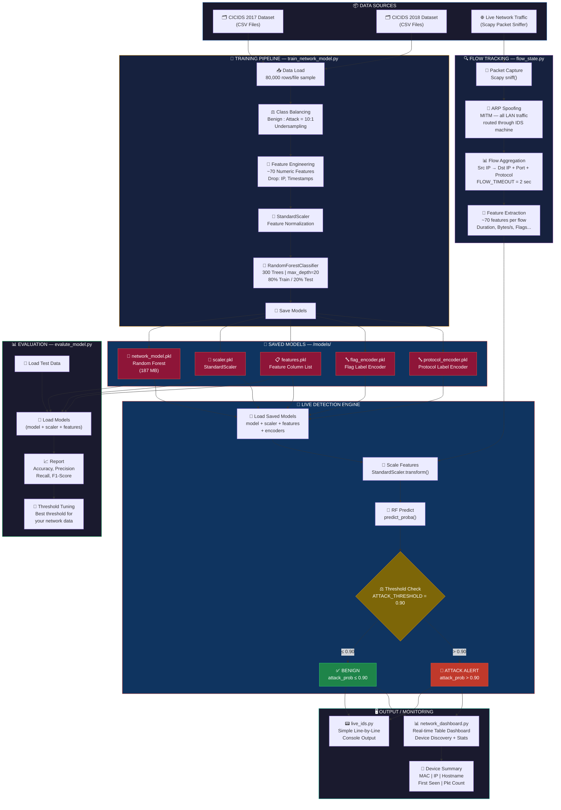
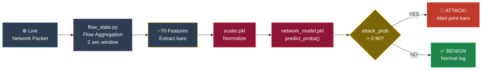
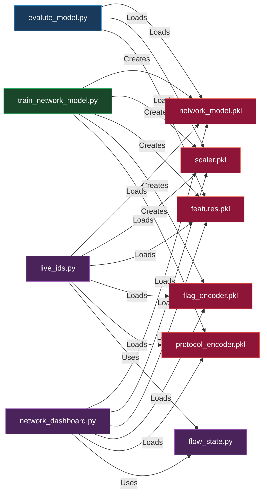

# 🛡️ NetGuardIDS

एक real-time, ML-powered **Network Intrusion Detection System** जो आपके पूरे LAN में malicious traffic को monitor करता है — trained Random Forest classifier, ARP spoofing (MITM), और Scapy की मदद से live packet capture करके।

---

## 📑 विषय सूची (Table of Contents)

- [संक्षिप्त परिचय](#संक्षिप्त-परिचय)
- [आर्किटेक्चर](#आर्किटेक्चर)
- [प्रोजेक्ट स्ट्रक्चर](#प्रोजेक्ट-स्ट्रक्चर)
- [यह कैसे काम करता है](#यह-कैसे-काम-करता-है)
- [IDS में Model का Role](#ids-में-model-का-role)
- [Installation और Requirements](#installation-और-requirements)
- [Quick Start — शुरुआत कैसे करें](#quick-start--शुरुआत-कैसे-करें)
- [Script Reference](#script-reference)
  - [live_ids.py](#live_idspy) — मुख्य live IDS (recommended)
  - [network_dashboard.py](#network_dashboardpy) — Visual dashboard
  - [train_network_model.py](#train_network_modelpy) — Model training
  - [evaluate_model.py](#evalute_modelpy) — Model evaluation
  - [flow_state.py](#flow_statepy) — Flow tracking engine
  - [capture_packets.py](#capture_packetspy) — Legacy capture script
  - [train_ids.py](#train_idspy) — Legacy simple IDS
  - [pcap_to_flow.py](#pcap_to_flowpy) — PCAP to CSV converter
- [Configuration Reference](#configuration-reference)
- [Model का Workflow](#model-का-workflow-पूरी-प्रक्रिया)
- [Model की जानकारी](#model-की-जानकारी)
- [Feature Reference](#feature-reference)
- [Datasets](#datasets)
- [Saved Model Files](#saved-model-files)
- [ARP Spoofing (MITM)](#arp-spoofing-mitm)
- [Threshold Tuning](#threshold-tuning)
- [समस्या निवारण (Troubleshooting)](#समस्या-निवारण-troubleshooting)

---

## संक्षिप्त परिचय

यह IDS **network flow level** पर काम करता है — packet-by-packet नहीं। यह:

1. **Capture करता है** — ARP spoofing के ज़रिये IDS machine को MITM बनाकर पूरे LAN का traffic लेता है।
2. **Group करता है** — packets को flows में बांटता है (`src_ip → dst_ip + port + protocol` के आधार पर)।
3. **Extract करता है** — हर completed flow से ~70 statistical features निकालता है।
4. **Predict करता है** — trained Random Forest model से बताता है कि flow `BENIGN` है या `ATTACK`।
5. **Display करता है** — real-time में results दिखाता है — scrolling log lines या live terminal dashboard।

**जिन attacks पर यह trained है:**
DDoS, Brute Force (SSH/FTP), SQL Injection, XSS, Bot, Port Scan, Web Attacks, DoS, Infiltration, और अन्य — CICIDS 2017 और 2018 benchmark datasets से।

---

## आर्किटेक्चर

```
┌─────────────────────────────────────────────────────────────────┐
│                     Network Devices (LAN)                       │
│  [PC]   [Laptop]   [Phone]   [IoT Device]   [Smart TV] ...     │
└────────────────────────┬────────────────────────────────────────┘
                         │  (सारा traffic ARP Spoof से redirect होता है)
                         ▼
┌─────────────────────────────────────────────────────────────────┐
│                 IDS Machine (यह PC)                             │
│                                                                 │
│  ┌──────────────┐   ┌─────────────────┐   ┌─────────────────┐  │
│  │  ARP Spoof   │   │  Packet Capture │   │  Hostname       │  │
│  │  Loop Thread │   │  (Scapy sniff)  │   │  Resolver       │  │
│  └──────┬───────┘   └────────┬────────┘   └────────┬────────┘  │
│         │                   │                      │            │
│         │              ┌────▼──────────────────┐   │            │
│         │              │    FlowState Engine   │   │            │
│         │              │  (flow_state.py)      │   │            │
│         │              │  हर flow का data track│   │            │
│         │              └────────────┬──────────┘   │            │
│         │                          │               │            │
│         │              ┌───────────▼─────────────┐ │            │
│         │              │  Prediction Queue       │ │            │
│         │              │  (Async background)     │ │            │
│         │              └───────────┬─────────────┘ │            │
│         │                          │               │            │
│         │              ┌───────────▼─────────────┐ │            │
│         └──────────────►  Random Forest Model    │ │            │
│                        │  (network_model.pkl)    ◄──┘            │
│                        └───────────┬─────────────┘              │
│                                    │                            │
│                ┌───────────────────▼───────────────────────┐    │
│                │  Output: Console Log  /  Rich Dashboard   │    │
│                └───────────────────────────────────────────┘    │
└─────────────────────────────────────────────────────────────────┘
```

---

## प्रोजेक्ट स्ट्रक्चर

```
ids model/
│
├── README.md                   ← English documentation
├── README_HI.md                ← यह फ़ाइल (Hindi documentation)
├── model_guide.md              ← पुरानी quick-reference गाइड
│
├── data/                       ← Training datasets (CSV files)
│   ├── Friday-WorkingHours-*.csv      (CICIDS 2017)
│   ├── Monday-WorkingHours.csv
│   ├── Tuesday-WorkingHours.csv
│   ├── Wednesday-workingHours.csv
│   ├── Thursday-WorkingHours-*.csv
│   ├── Friday-02-03-2018.csv          (CIC-IDS-2018)
│   ├── Thursday-22-02-2018.csv
│   ├── CTU13_Attack_Traffic.csv
│   ├── final_dataset.csv              (merged, pre-processed)
│   └── ...
│
├── models/                     ← Trained model artifacts
│   ├── network_model.pkl       ← Trained Random Forest classifier
│   ├── scaler.pkl              ← StandardScaler (training data पर fit किया)
│   ├── features.pkl            ← Feature columns की list
│   ├── flag_encoder.pkl        ← (Legacy) flags के लिए label encoder
│   └── protocol_encoder.pkl    ← (Legacy) protocol के लिए label encoder
│
└── scripts/                    ← सभी Python scripts
    ├── live_ids_auto.py        ← ★ मुख्य: Universal multi-interface IDS
    ├── live_ids.py             ← Legacy Ethernet-only IDS
    ├── live_ids_wifi.py        ← live_ids.py का Wi-Fi version
    ├── network_dashboard.py    ← Rich terminal dashboard (visual mode)
    ├── flow_state.py           ← Flow tracking engine (shared module)
    ├── train_network_model.py  ← Random Forest model train करता है
    ├── evaluate_model.py        ← Model की accuracy + threshold sweep देखता है
    ├── capture_packets.py      ← Legacy basic capture script
    ├── train_ids.py            ← Legacy simple IDS (ARP spoof नहीं)
    ├── pcap_to_flow.py         ← PCAP → flow CSV converter
    ├── pcap_to_dataset.py      ← PCAP → training dataset CSV
    ├── generate_dataset.py     ← Dataset generation helper
    ├── test_flow_phase1.py     ← Flow feature extraction का unit test
    └── benign_traffic.pcap     ← Sample benign traffic capture file
```

---

## यह कैसे काम करता है

### 1. Interface Selection (Auto-detect)

`live_ids.py` 3-step priority system से सबसे अच्छा network interface खुद चुनता है:

1. **`netifaces` (सबसे reliable)** — OS routing table से default gateway interface ढूंढता है, फिर Scapy NPF path बनाता है।
2. **IP-based heuristic** — सभी interfaces check करता है; loopback (`127.*`), APIPA (`169.254.*`), VirtualBox/VMware subnets skip करता है; Ethernet को Wi-Fi से prefer करता है।
3. **Scapy default fallback** — आखिरी option — `conf.iface` use करता है।

अगर आप manually interface set करना चाहें तो script के ऊपर यह लिखें:
```python
INTERFACE = "\\Device\\NPF_{YOUR-GUID}"
```

---

### 2. ARP Scanning (नेटवर्क पर devices ढूंढना)

शुरुआत में पूरे `/24` subnet पर ARP broadcast भेजा जाता है जिससे सभी live hosts का पता चलता है। यह `discovered_ips` table में save होता है।

एक background thread **हर 60 seconds** में दोबारा scan करता है, ताकि नए devices miss न हों।

---

### 3. ARP Spoofing (MITM — पूरे नेटवर्क का traffic देखना)

दूसरे devices के बीच होने वाले traffic को देखने के लिए ARP spoofing use होती है:

- **हर LAN device को बोलते हैं:** "Gateway का MAC = मेरा MAC" → सारा outbound traffic IDS machine पर आता है।
- **Gateway को बोलते हैं:** "हर device का MAC = मेरा MAC" → सारा inbound traffic भी हमसे गुज़रता है।
- **Windows IP forwarding** enable होती है ताकि IDS machine packets forward करे (internet बंद न हो)।

`Ctrl+C` दबाने पर ARP tables **restore** हो जाती हैं और IP forwarding **disable** हो जाती है।

---

### 4. Flow Tracking (`flow_state.py`)

हर unique 5-tuple `(src_ip, dst_ip, src_port, dst_port, protocol)` को एक `FlowState` object के रूप में track किया जाता है। Flow में यह सब जमा होता है:
- Packet counts (forward और backward)
- Byte totals
- Inter-arrival times (IAT statistics)
- TCP flag counts (SYN, ACK, FIN, RST, PSH, URG, CWE, ECE)
- Packet length statistics (min, max, mean, std)
- Window sizes, header lengths, active/idle time

जब flow `FLOW_TIMEOUT` seconds से ज़्यादा हो जाता है तो उसे close करके features निकाले जाते हैं और prediction queue में भेजा जाता है।

---

### 5. Asynchronous Prediction (Background में prediction)

Predictions एक **अलग background thread** में होती हैं ताकि Scapy का packet capture कभी block न हो। Completed flows `Queue(maxsize=500)` में queue होते हैं।

Prediction worker:
1. Queue से `(features, meta)` tuple निकालता है।
2. Feature names को scaler के expected column order से align करता है।
3. `StandardScaler` से features scale करता है।
4. `model.predict_proba()` call करके `[benign_prob, attack_prob]` लेता है।
5. Label, probability, source/destination, port, protocol, और LAN/WAN direction के साथ result print करता है।

---

### 6. Output (आउटपुट)

**`live_ids.py`** — plain text line output:
```
[12:05:33]    BENIGN  (0.07) | 192.168.1.45 (aa:bb:cc:...) -> 8.8.8.8 | Port 443 | TCP | LAN->WAN
[12:05:34] !! ATTACK  (0.94) | 192.168.1.22 (dd:ee:ff:...) -> 192.168.1.1 | Port 22 | TCP | LAN->LAN
```

**`network_dashboard.py`** — एक Rich live terminal table जो सभी devices, उनका status, attack probability, port, protocol और traffic direction हर second update करके दिखाती है।

---

## IDS में Model का Role

Machine learning model इस IDS का **दिमाग** है। बाकी सब — packet capture, ARP spoofing, flow tracking — सिर्फ model को साफ और structured input देने के लिए है। यहाँ विस्तार से बताया गया है कि model क्या करता है, कब चलता है, और कैसे फैसला लेता है।

---

### Model किस समस्या को सुलझाता है?

पुराने IDS tools **rule-based signatures** use करते थे — जैसे "अगर packet में यह exact bytes हैं तो यह attack है"। यह approach इन cases में fail होती है:
- नए या modified attacks जो पुराने signatures से match नहीं करते।
- Encrypted traffic जिसमें payload देखा नहीं जा सकता।
- Slow/distributed attacks जो packet-by-packet normal लगते हैं।

यह IDS एक **machine learning model** use करता है। यह packets का content नहीं देखता, बल्कि पूरे flows का **statistical behaviour** देखता है — timing patterns, byte rates, flag ratios। DDoS flood, port scan, और brute force — हर attack का एक अलग statistical fingerprint होता है जो model ने ~20 लाख real-world labelled samples से सीखा है।

---

### Model क्या नहीं करता?

| यह नहीं करता | बल्कि यह करता है |
|---|---|
| Packet payload / content inspect करना | सिर्फ statistical metadata analyze करता है |
| Traffic block करना | सिर्फ detect करके alert देता है |
| हर packet पर real-time काम | हर flow पर काम करता है (`FLOW_TIMEOUT` seconds बाद) |
| यह बताना कि attack किस type का है | सिर्फ binary: BENIGN या ATTACK |
| Live monitoring में खुद update होना | Training के बाद frozen रहता है — static model |

---

### Model Type: Random Forest Classifier

**Random Forest** 300 independent Decision Trees का एक ensemble है। हर tree अलग से `BENIGN` या `ATTACK` vote करता है। Final output वह **fraction** है जिसमें कितने trees ने ATTACK vote किया — यही `attack_probability` है (0.0 से 1.0 के बीच)।

```
  Flow Features
       │
       ├──► Tree  1  →  BENIGN
       ├──► Tree  2  →  ATTACK
       ├──► Tree  3  →  ATTACK
       ├──► Tree  4  →  BENIGN
       │        ...  (300 total)
       └──► Tree  300 → ATTACK

  ATTACK votes = 240 / 300 = 0.80  →  attack_probability = 0.80
  Threshold = 0.40  →  0.80 > 0.40  →  !! ATTACK
```

Random Forest क्यों चुना:
- Network traffic के non-linear patterns अच्छे से handle करता है।
- Noisy features और outliers के साथ robust है।
- `predict_proba()` से calibrated probabilities देता है।
- बड़े tabular datasets पर efficiently train होता है।
- Interpretable है (feature importances देखे जा सकते हैं)।

---

### Pipeline में Model कहाँ चलता है?

```
Packet आता है
    │
    ▼
Scapy sniff() → process_packet()
    │
    ├── ARP packet? → MAC सीखो, skip करो
    │
    ├── IP नहीं? → skip
    │
    ├── Multicast/broadcast? → skip
    │
    ▼
FlowState.update()       ← packet को उसके flow में add करो
    │
    ├── Flow duration < FLOW_TIMEOUT? → और packets का इंतज़ार करो
    │
    ▼
FlowState.build_basic_features()  ← ~68 features निकालो
    │
    ▼
prediction_queue.put((features, meta))   ← background worker के लिए queue करो
    │
    ▼
[Background Thread] prediction_worker()
    │
    ▼
predict_flow(features, meta)
    │
    ├── feature dict को COLUMN_ORDER से align करो
    ├── pd.DataFrame([aligned])    ← Named columns (sklearn warning से बचाव)
    ├── scaler.transform(df)       ← StandardScaler से normalize करो
    └── model.predict_proba(scaled)[0][1]  ← attack probability लो
            │
            ├── prob > ATTACK_THRESHOLD  →  ATTACK print करो
            └── prob ≤ ATTACK_THRESHOLD  →  BENIGN print करो
```

> Model **main capture thread से अलग** — एक background worker में — चलता है, इसलिए model inference का समय packet capture को कभी affect नहीं करता।

---

### Model ने कौन से attacks पहचानना सीखा है?

Model को CICIDS 2017, CIC-IDS 2018, और CTU-13 के labelled flows से train किया गया है। हर attack type के statistical patterns जो model पकड़ता है:

| Attack Type | Model किस statistical signal से पहचानता है |
|---|---|
| **DDoS / DoS** | बहुत ज़्यादा `Flow Pkts/s` और `SYN Flag Cnt`; बहुत कम `Flow Duration`; छोटा `Fwd Pkt Len Mean` |
| **SYN Flood** | `SYN Flag Cnt` >> `ACK Flag Cnt`; ज़्यादा `SYN Rate`; `Flow Duration` लगभग zero |
| **Port Scan** | ज़्यादा `RST Flag Cnt`; कई unique `Dst Port` values; बहुत short flows; ज़्यादा `RST Rate` |
| **Brute Force (SSH/FTP)** | Same port (22/21) पर बार-बार flows; repeated connection attempts; कम `Down/Up Ratio` |
| **Web Attacks (SQLi, XSS)** | HTTP port (80/443); असामान्य `Fwd Pkt Len` spikes; कम `Tot Bwd Pkts` |
| **Botnet** | Periodic flows; regular `Flow IAT Mean`; consistent छोटे packet sizes |
| **Infiltration** | असामान्य `Init Fwd Win Byts`; बड़ा backward transfer (`TotLen Bwd Pkts`) |

---

### Prediction Input: Feature Alignment

Prediction से पहले एक ज़रूरी step है — **feature alignment**। Scaler को training के दौरान एक specific list of feature columns पर fit किया गया था (यह `scaler.feature_names_in_` में stored है)। Live flow को बिल्कुल उसी order में वही features देने होते हैं:

```python
# predict_flow() में:
COLUMN_ORDER = list(scaler.feature_names_in_)   # startup पर एक बार load होता है

# हर flow के लिए prediction time पर:
aligned = {col: float(features.get(col, 0)) for col in COLUMN_ORDER}
# Flow में कोई feature missing हो तो 0.0 से fill होता है (safe default)

df = pd.DataFrame([aligned])      # Named DataFrame — sklearn warnings से बचाव
scaled = scaler.transform(df)     # Z-score से हर feature normalize करो
prob = model.predict_proba(scaled)[0][1]   # Index [1] = attack class probability
```

**StandardScaler क्यों?** Random Forest tree-based है और technically इसे scaling की ज़रूरत नहीं, लेकिन training में scaler apply किया था, इसलिए inference में भी करना ज़रूरी है — वरना features की distribution अलग होगी और predictions गलत आएंगी।

---

### Prediction Output का मतलब

```
model.predict_proba(X)  →  [benign_prob, attack_prob]
                              e.g. [0.08,      0.92]
```

| `attack_prob` की value | मतलब |
|---|---|
| `0.00 – 0.10` | बहुत संभावना है कि benign — routine traffic |
| `0.10 – 0.39` | शायद benign — छोटी anomaly |
| `0.40 – 0.69` | Suspicious — इस IP पर नज़र रखें |
| `0.70 – 0.89` | Likely attack — investigate करें |
| `0.90 – 1.00` | High-confidence attack |

Settings में `ATTACK_THRESHOLD` वह line है जो `!! ATTACK` और `BENIGN` के बीच फर्क करती है। इसे tune करें — कम value ज़्यादा attacks catch करती है लेकिन false positives भी बढ़ते हैं।

---

### Training vs Inference का सारांश

| Phase | Script | क्या होता है |
|---|---|---|
| **Training** | `train_network_model.py` | CSVs पढ़ता है, features निकालता है, scaler fit करता है, 300-tree forest train करता है, `.pkl` files save करता है |
| **Inference (Live)** | `live_ids.py` | Startup पर `.pkl` files load करता है, हर completed flow पर `predict_proba()` चलाता है |
| **Evaluation** | `evaluate_model.py` | `.pkl` files load करता है, held-out CSV पर predictions चलाता है, accuracy + threshold sweep दिखाता है |

Model **training time पर frozen हो जाता है**। यह live traffic से नहीं सीखता। इसे बेहतर बनाने के लिए `train_network_model.py` को नए data के साथ फिर से train करें।

---

## Installation और Requirements

### ज़रूरी चीजें

- Python 3.8+
- [Npcap](https://npcap.com/) installed (Windows packet capture driver — **ज़रूरी है**)
- Windows पर scripts को **Administrator** के रूप में चलाएं (raw sockets को elevated privileges चाहिए)

### Dependencies Install करें

```bash
pip install scapy joblib pandas numpy scikit-learn rich netifaces
```

> **Note:** `netifaces` optional है लेकिन Windows पर reliable gateway detection के लिए strongly recommended है। इसके बिना system `route print` output को parse करके fallback करता है।

---

## Quick Start — शुरुआत कैसे करें

### पहली बार Setup (Model Train करें)

सिर्फ एक बार ज़रूरी है। अगर `models/network_model.pkl` पहले से है तो skip करें।

```bash
# Project root से चलाएं — data/ में CSV files होनी चाहिए
python scripts/train_network_model.py
```

Expected output: accuracy report + `model saved successfully!`

---

### Live IDS चलाएं (Recommended)

```bash
# Administrator के रूप में चलाएं!
python scripts/live_ids_auto.py
```

Output:
```
=================================================================
[NetGuardIDS] Live IDS Started -- Full Network Discovery Mode
   Model expects 68 features
=================================================================
[*] Auto-selected via routing table : \Device\NPF_{...}  (IP: 192.168.1.100, GW: 192.168.1.1)
[*] Mode        : Full Ethernet Network
[*] Interface   : \Device\NPF_{...}
[*] Threshold   : 0.40
[*] Flow Timeout: 1s
...
[12:00:01]    BENIGN  (0.03) | 192.168.1.5 -> 8.8.8.8 | Port 443 | TCP | LAN->WAN
```

रोकने के लिए `Ctrl+C` दबाएं — ARP tables automatically restore हो जाएंगी।

---

### Visual Dashboard चलाएं

```bash
# Administrator के रूप में चलाएं!
python scripts/network_dashboard.py
```

Full-screen Rich table दिखती है जिसमें सभी discovered devices color-coded attack status के साथ होते हैं।

---

### Model की Performance देखें

```bash
python scripts/evaluate_model.py
```

Accuracy, classification report, confusion matrix, और optimal threshold ढूंढने के लिए threshold sweep table दिखाता है।

---

## Script Reference

---

### `live_ids.py`

**मुख्य production IDS script।** ARP spoofing, async prediction, और device discovery के साथ full network monitoring।

**मुख्य functions:**

| Function | काम |
|---|---|
| `pick_interface()` | netifaces → IP heuristics → Scapy default से best interface auto-detect करता है |
| `arp_scan(subnet, iface)` | सभी LAN hosts discover करने के लिए ARP broadcast भेजता है |
| `periodic_arp_scan(subnet, iface, interval)` | Background thread: हर N seconds में re-scan |
| `get_gateway_ip(local_ip)` | Routing table (netifaces या `route print`) से real gateway ढूंढता है |
| `get_mac(ip, iface)` | ARP से IP का MAC address resolve करता है |
| `get_own_mac(iface)` | Interface से सीधे इस machine का MAC लेता है |
| `enable_ip_forwarding()` | Windows IP forwarding netsh + registry से enable करता है |
| `disable_ip_forwarding()` | Exit पर IP forwarding disable करता है |
| `arp_spoof_loop(iface)` | सभी discovered devices और gateway के ARP caches को लगातार poison करता है |
| `stop_arp_spoof(iface)` | सभी ARP tables restore करता है और IP forwarding disable करता है |
| `process_packet(pkt)` | Scapy हर captured packet के लिए call करता है; flows update करता है, devices register करता है |
| `handle_arp(pkt)` | Passive ARP observation से IP→MAC mappings सीखता है |
| `prediction_worker()` | Background thread: queue से flows pop करके model prediction चलाता है |
| `predict_flow(features, meta)` | Features scale करके `model.predict_proba()` call करता है |
| `hostname_worker()` | Background thread: reverse DNS से IPs को hostnames में resolve करता है |
| `register_device(ip, mac)` | `discovered_ips` में एक discovered device track करता है |
| `cleanup_stale_flows()` | 30+ seconds से update न हुए flows हटाता है |
| `print_device_summary()` | Exit पर सभी seen devices की summary table print करता है |

**Script के ऊपर मुख्य settings:**

```python
ATTACK_THRESHOLD = 0.40    # ATTACK label के लिए minimum probability
FLOW_TIMEOUT     = 1       # Flow complete होने से पहले के seconds
DEVICE_ONLY_MODE = False   # True = सिर्फ इस machine का traffic; False = पूरा LAN
INTERFACE        = None    # None = auto-detect; या NPF GUID string set करें
ARP_SCAN_SUBNET  = None    # None = interface से auto; या "192.168.1.0/24"
ARP_SPOOF_ENABLED = True   # ARP spoofing (MITM) enable/disable करें
```

---

### `network_dashboard.py`

**Rich terminal dashboard।** सभी LAN devices की ML prediction status के साथ live-updating table।

**Dashboard के columns:**

| Column | मतलब |
|---|---|
| `#` | Row number |
| `IP Address` | Source IP (लाल = attack, पीला = active traffic, सफेद = सिर्फ discovered) |
| `MAC` | ARP/Ethernet layer से MAC address |
| `Status` | `ATTACK` / `ACTIVE` / `DISCOVERED` |
| `Atk %` | Attack probability percentage में |
| `Port` | Latest classified flow का destination port |
| `Proto` | `TCP` / `UDP` |
| `Direction` | `LAN->LAN`, `LAN->WAN`, `WAN->LAN` |
| `Attacks` | इस IP से attack classify हुए कुल flows |
| `Flows` | इस IP से देखे गए कुल flows |
| `Last Seen` | सबसे recent activity का समय |

**मुख्य settings:**

```python
ATTACK_THRESHOLD = 0.90    # live_ids.py से ज़्यादा strict (visual clarity के लिए)
FLOW_TIMEOUT     = 2       # Seconds per flow
REFRESH_RATE     = 1       # Dashboard refresh interval (seconds)
ARP_RESCAN_SECS  = 60      # Background ARP rescan interval
SHOW_PRIVATE     = True    # LAN IPs दिखाएं
SHOW_PUBLIC      = True    # WAN (internet) IPs दिखाएं
```

> **Note:** Dashboard packet sniffing एक background thread में चलाता है और display main thread में `rich.live.Live` से update होती है। रोकने के लिए `Ctrl+C` दबाएं।

---

### `train_network_model.py`

**एक बार चलाने वाली model training script।** `data/` के सभी CSVs पढ़ता है, sample करता है, balance करता है, Random Forest train करता है, और model artifacts save करता है।

**Training pipeline:**

| Step | काम | Details |
|---|---|---|
| 1 | **Load** | `data/` से सभी `.csv` files पढ़ता है, हर file से max 80,000 rows sample करता है |
| 2 | **Normalize** | 2017 column names → 2018 format में map करता है (जैसे `Destination Port` → `Dst Port`) |
| 3 | **Clean** | IP/timestamp columns drop करता है, `inf`/`NaN` replace करता है |
| 4 | **Balance** | Benign traffic को `attack_count × 10` तक undersample करता है (realistic ratio) |
| 5 | **Scale** | Training data पर `StandardScaler` fit करता है |
| 6 | **Split** | 80% train / 20% test |
| 7 | **Train** | `RandomForestClassifier(n_estimators=300, max_depth=20, min_samples_leaf=5)` |
| 8 | **Evaluate** | Test set पर accuracy + classification report print करता है |
| 9 | **Save** | `models/` में `network_model.pkl`, `scaler.pkl`, `features.pkl` save करता है |

**मुख्य settings:**

```python
SAMPLE_PER_FILE = 80000       # हर CSV file से max rows
DROP_COLUMNS    = ["Flow ID", "Src IP", "Dst IP", "Timestamp", "Src Port"]
TEST_SIZE       = 0.2         # 20% evaluation के लिए रखें
```

---

### `evaluate_model.py`

**Standalone model evaluation।** Saved model को एक held-out dataset पर test करता है और threshold sweep करता है।

**Output में शामिल है:**

1. **Default threshold (0.5):** Accuracy, full classification report, confusion matrix।
2. **Confusion matrix breakdown:**
   - True Negatives (benign सही identify हुए)
   - False Positives (benign को attack समझा)
   - False Negatives (attacks miss हुए)
   - True Positives (attacks सही catch हुए)
3. **Threshold sweep table:** `[0.5, 0.4, 0.3, 0.2, 0.15, 0.1, 0.05]` thresholds test करता है — detection rate, false alarm rate, precision, और F1 score दिखाता है। Best threshold automatically mark होता है।

**Use कैसे करें:**

```bash
python scripts/evaluate_model.py
```

> अलग test CSV use करने के लिए script के ऊपर `DATA_PATH` edit करें। Default है `Thursday-22-02-2018.csv`।

---

### `flow_state.py`

**Core shared module** — `live_ids.py`, `network_dashboard.py`, `train_ids.py`, और `capture_packets.py` इसे import करते हैं।

एक single network flow की statistics packets आने पर track करता है।

**Class: `FlowState`**

| Method | काम |
|---|---|
| `__init__(key, first_packet)` | सभी counters, timestamps initialize करता है और पहला packet process करता है |
| `update(packet)` | Flow के हर नए packet के लिए सभी counters update करता है |
| `flow_duration()` | Flow start से अब तक के seconds return करता है |
| `compute_stats(arr)` | किसी list के लिए `(mean, std, max, min)` return करता है |
| `compute_iat_stats(timestamps)` | Inter-arrival times का `(mean, std, max, min, total)` return करता है |
| `build_basic_features()` | Model input के लिए तैयार सभी ~68 features का `dict` return करता है |

**Track किए जाने वाले features:**
- Packet counts प्रति direction (forward/backward)
- Byte totals प्रति direction
- Packet length statistics (min, max, mean, std, var) प्रति direction
- Flow IAT (inter-arrival time) statistics
- Forward/backward IAT statistics
- TCP window sizes (`init_fwd_win_bytes`, `init_bwd_win_bytes`)
- TCP flags: FIN, SYN, RST, PSH, ACK, URG, CWE, ECE
- Header lengths
- Active/idle time periods
- Flow bytes/s, packets/s (प्रति direction)
- Subflow statistics
- Unique destination ports
- Down/Up ratio

---

### `capture_packets.py`

**Legacy basic capture script।** `live_ids.py` का पुराना version — simpler feature extraction (11 features), ARP spoofing नहीं, device discovery नहीं, async prediction नहीं।

Reference के लिए रखा गया है। Production के लिए `live_ids.py` use करें।

---

### `train_ids.py`

**Legacy simple IDS।** एक पुराना version जो `FlowState` use करता है लेकिन ARP spoofing, device tracking, async prediction queue नहीं है। Prediction पर block/रुक जाता है।

Reference के लिए रखा गया है। Production के लिए `live_ids.py` use करें।

---

### `pcap_to_flow.py`

**Utility script।** एक `.pcap` file पढ़ता है, उसी 5-tuple method से flows extract करता है, और सभी flow features का CSV `data/benign_live1.csv` में लिखता है। Captured traffic से benign baseline datasets बनाने के काम आता है।

**Use कैसे करें:**
```bash
# Script के ऊपर PCAP_PATH और OUTPUT_PATH edit करें, फिर:
python scripts/pcap_to_flow.py
```

---

## Configuration Reference

सभी settings **हर script के ऊपर** clearly labelled हैं।

### `live_ids.py` Settings

| Setting | Type | Default | मतलब |
|---|---|---|---|
| `ATTACK_THRESHOLD` | `float` | `0.40` | Alert trigger करने के लिए minimum attack probability |
| `FLOW_TIMEOUT` | `int` | `1` | Flow finalize होने और prediction के लिए भेजने से पहले के seconds |
| `DEVICE_ONLY_MODE` | `bool` | `False` | `True` = सिर्फ इस machine का traffic; `False` = पूरा LAN |
| `INTERFACE` | `str\|None` | `None` | Specific NPF interface GUID force करें, या auto-detect के लिए `None` |
| `ARP_SCAN_SUBNET` | `str\|None` | `None` | ARP scan subnet override करें (जैसे `"192.168.1.0/24"`) |
| `ARP_SPOOF_ENABLED` | `bool` | `True` | ARP spoofing (MITM) enable/disable |

### `network_dashboard.py` Settings

| Setting | Type | Default | मतलब |
|---|---|---|---|
| `ATTACK_THRESHOLD` | `float` | `0.90` | Alert threshold |
| `FLOW_TIMEOUT` | `int` | `2` | Seconds per flow |
| `DEVICE_ONLY_MODE` | `bool` | `False` | Monitor mode |
| `INTERFACE` | `str\|None` | `None` | Interface force करें |
| `REFRESH_RATE` | `int` | `1` | Dashboard refresh interval (seconds) |
| `ARP_RESCAN_SECS` | `int` | `60` | Background ARP re-scan interval |
| `SHOW_PRIVATE` | `bool` | `True` | Private/LAN IPs दिखाएं |
| `SHOW_PUBLIC` | `bool` | `True` | Public/WAN IPs दिखाएं |

### `train_network_model.py` Settings

| Setting | Type | Default | मतलब |
|---|---|---|---|
| `SAMPLE_PER_FILE` | `int` | `80000` | Training के दौरान हर CSV से max rows |
| `TEST_SIZE` | `float` | `0.2` | Testing के लिए रखी जाने वाली data की fraction |
| `RANDOM_STATE` | `int` | `42` | Reproducibility के लिए random seed |

---

## Model का Workflow (पूरी प्रक्रिया)

यह section model का **पूरा end-to-end workflow** दिखाता है — raw data से लेकर live alert तक — दो phases में।

---

### Phase 1 — Offline Training (सिर्फ एक बार)

```
┌─────────────────────────────────────────────────────────────┐
│              train_network_model.py                         │
└─────────────────────────────────────────────────────────────┘

  data/ folder
  ┌──────────────────────────────────────┐
  │  CICIDS2017 CSVs  (8 files)          │
  │  CIC-IDS2018 CSVs (8 files)          │
  │  CTU-13 CSV       (1 file)           │
  └──────────────────┬───────────────────┘
                     │  पढ़ो + sample करो (80,000 rows / file)
                     ▼
          ┌──────────────────────┐
          │  columns normalize   │  ← 2017 names → 2018 names
          │  IP/timestamps drop  │
          │  inf / NaN fix       │
          └──────────┬───────────┘
                     │
                     ▼
          ┌──────────────────────┐
          │  Label → Binary      │  BENIGN=0 / बाकी सब=1
          │  Classes balance     │  benign ≤ attack × 10
          └──────────┬───────────┘
                     │
                     ▼
          ┌──────────────────────┐
          │  StandardScaler      │  training features पर fit
          │  .fit_transform(X)   │  → Z-score normalise
          └──────────┬───────────┘
                     │
                     ▼
          ┌──────────────────────┐
          │  train / test split  │  80% train  /  20% test
          └──────────┬───────────┘
                     │
                     ▼
          ┌──────────────────────────────────────────┐
          │  RandomForestClassifier                  │
          │    n_estimators = 300  (300 trees)       │
          │    max_depth    = 20                     │
          │    class_weight = "balanced"             │
          │  .fit(X_train, y_train)                  │
          └──────────┬───────────────────────────────┘
                     │
                     ▼
          ┌──────────────────────┐
          │  X_test पर evaluate  │  → accuracy, precision,
          │                      │    recall, F1 print होता है
          └──────────┬───────────┘
                     │
                     ▼
          ┌──────────────────────────────────────┐
          │  models/network_model.pkl  (187 MB)  │  ← trained forest
          │  models/scaler.pkl         (~4 KB)   │  ← fitted scaler
          │  models/features.pkl       (~1 KB)   │  ← column order
          └──────────────────────────────────────┘
```

---

### Phase 2 — Live Inference (लगातार चलता है)

```
┌─────────────────────────────────────────────────────────────┐
│                  live_ids.py  (startup)                     │
└─────────────────────────────────────────────────────────────┘

  models/
  ├── network_model.pkl  ──┐
  ├── scaler.pkl          ─┼──► joblib.load() → RAM में load
  └── features.pkl        ──┘   (startup पर एक बार)

         │
         ▼
  Interface auto-detect  →  ARP scan  →  Gateway MAC मिला
  IP Forwarding enable   →  ARP Spoof loop शुरू (background)

         │
         ▼  (main loop — Ctrl+C तक चलता है)
  ┌──────────────────────────────────────────────────────────┐
  │                  Scapy sniff()                           │
  │            promisc=True, store=False                     │
  └──────────────────────┬───────────────────────────────────┘
                         │  हर packet पर
                         ▼
               process_packet(pkt)
                         │
          ┌──────────────┼───────────────┐
          │              │               │
       ARP?         IP नहीं?      Multicast?
          │              │               │
     MAC सीखो         skip           skip
     return
          │
          ▼  (IP packet आगे जाता है)
   get_key(pkt)  →  (src_ip, dst_ip, sport, dport, proto)
          │
          ▼
   FlowState dict में key है?
          │
      [हाँ]    [नहीं]
          │         │
   .update(pkt)  FlowState(key, pkt)  ← नया flow बना
          │
          ▼
   flow.flow_duration() > FLOW_TIMEOUT?
          │
       [नहीं] ──► और packets का इंतज़ार करो
          │
       [हाँ]
          │
          ▼
   FlowState.build_basic_features()
   ~68 features का dict return होता है:
   {
     "Flow Duration":     ...,
     "SYN Flag Cnt":      ...,
     "Flow Pkts/s":       ...,
     "Init Fwd Win Byts": ...,
     ...कुल 68...
   }
          │
          ▼
   prediction_queue.put((features, meta))
   del flows[key]   ← flow बंद
          │
          │  (enqueued — main thread तुरंत sniff पर वापस)
          │
          ▼  [Background Thread]
   prediction_worker()  item dequeue करता है
          │
          ▼
   predict_flow(features, meta)
          │
          ├── aligned = {col: features.get(col, 0)
          │              for col in COLUMN_ORDER}
          │              (missing feature → 0.0)
          │
          ├── df = pd.DataFrame([aligned])
          │         (named columns → sklearn warning नहीं)
          │
          ├── scaled = scaler.transform(df)
          │         (fitted scaler से Z-score normalise)
          │
          └── prob = model.predict_proba(scaled)[0][1]
                    ↑ index [1] = attack class की probability

                         │
          ┌──────────────┴──────────────┐
          │                             │
  prob > ATTACK_THRESHOLD       prob ≤ ATTACK_THRESHOLD
          │                             │
  !! ATTACK  (prob)             BENIGN  (prob)
  src_ip → dst_ip              src_ip → dst_ip
  Port | Proto | Direction      Port | Proto | Direction
          │
          ▼  (Ctrl+C पर)
  stop_arp_spoof()  →  सभी ARP tables restore
  disable_ip_forwarding()
  print_device_summary()
```

---

### Data Flow Summary (सारी प्रक्रिया एक नज़र में)

| Stage | Input | Process | Output |
|---|---|---|---|
| **Data Load** | CSV files | पढ़ो + sample करो | Raw DataFrames |
| **Cleaning** | Raw DataFrames | Columns drop, NaN/inf fix | Clean DataFrames |
| **Labelling** | `Label` column | `"BENIGN"→0`, बाकी→1 | Binary `y` vector |
| **Balancing** | `y` vector | Benign undersample | Balanced dataset |
| **Scaling** | Feature matrix `X` | `StandardScaler.fit_transform()` | Normalised `X_scaled` |
| **Training** | `X_scaled`, `y` | `RandomForest.fit()` | Trained model (300 trees) |
| **Saving** | Trained objects | `joblib.dump()` | `.pkl` files |
| **Loading** (live) | `.pkl` files | `joblib.load()` | Model + scaler RAM में |
| **Packet Capture** | Network interface | `scapy.sniff()` | Raw packets |
| **Flow Building** | Raw packets | `FlowState.update()` | Per-flow statistics |
| **Feature Extraction** | FlowState | `build_basic_features()` | Feature dict (68 keys) |
| **Alignment** | Feature dict | `COLUMN_ORDER` से match | Aligned dict → DataFrame |
| **Normalisation** | DataFrame | `scaler.transform()` | Scaled array |
| **Prediction** | Scaled array | `model.predict_proba()` | `[benign_prob, attack_prob]` |
| **Alert** | `attack_prob` | `ATTACK_THRESHOLD` से compare | `BENIGN` या `!! ATTACK` |

---

### मुख्य Decision Points (कहाँ क्या फैसला होता है)

```
Decision 1 — कौन सा interface use करें?
  └── netifaces से gateway interface मिला?  हाँ → use करो
      └── routable non-APIPA IP मिला?       हाँ → use करो
          └── conf.iface पर fallback

Decision 2 — यह packet process करना है?
  ├── ARP?           → MAC सीखो, prediction skip
  ├── IP layer नहीं? → skip
  └── Multicast/broadcast dst? → skip

Decision 3 — Flow prediction के लिए ready है?
  └── flow_duration() > FLOW_TIMEOUT?
      नहीं → और packets इकट्ठा करो
      हाँ  → features निकालो, enqueue करो, flow बंद करो

Decision 4 — यह attack है?
  └── attack_prob > ATTACK_THRESHOLD?
      हाँ → ATTACK alert print करो
      नहीं → BENIGN print करो
```

---

## Model की जानकारी

### Algorithm

scikit-learn का **Random Forest Classifier**।

```python
RandomForestClassifier(
    n_estimators   = 300,      # 300 decision trees
    max_depth      = 20,       # Max tree depth (overfitting limit करता है)
    min_samples_split = 5,
    min_samples_leaf  = 5,     # Leaf पर min samples (generalisation के लिए)
    class_weight   = "balanced",  # Class imbalance automatically handle करता है
    n_jobs         = -1,       # सभी CPU cores use करो
)
```

### Prediction

- **Input:** ~68 network flow features (`StandardScaler` से standardised)
- **Output:** `[benign_probability, attack_probability]`

```
अगर attack_prob >  ATTACK_THRESHOLD  →  ATTACK  !!
अगर attack_prob <= ATTACK_THRESHOLD  →  BENIGN
```

### Training Data

| Source | Type | Coverage |
|---|---|---|
| CICIDS 2017 | Benchmark | Mon–Fri traffic, DDoS, PortScan, Web Attacks, आदि |
| CIC-IDS 2018 | Benchmark | DDoS, Brute Force, Infiltration, Botnet, आदि |
| CTU-13 | Botnet | Botnet traffic scenarios |

हर CSV file से max **80,000 rows sample** किए जाते हैं। Benign traffic को `attack_count × 10` तक undersample किया जाता है।

### Binary Labels

| Label | Value | मतलब |
|---|---|---|
| `BENIGN` | `0` | Normal / safe traffic |
| कोई भी attack name | `1` | Malicious traffic |

---

## Feature Reference

Model `FlowState.build_basic_features()` से compute किए ~68 features use करता है:

### Flow-Level

| Feature | मतलब |
|---|---|
| `Dst Port` | Destination port number |
| `Protocol` | IP protocol number (6=TCP, 17=UDP) |
| `Flow Duration` | Flow की कुल duration seconds में |

### Packet Counts

| Feature | मतलब |
|---|---|
| `Tot Fwd Pkts` | कुल forward (sender→receiver) packets |
| `Tot Bwd Pkts` | कुल backward (receiver→sender) packets |
| `TotLen Fwd Pkts` | कुल forward bytes |
| `TotLen Bwd Pkts` | कुल backward bytes |
| `Total Packets` | सभी packets मिलाकर |
| `Total Bytes` | सभी bytes मिलाकर |
| `Unique Dst Ports` | Flow में unique destination ports की संख्या |

### Packet Length Statistics

| Feature | मतलब |
|---|---|
| `Fwd Pkt Len Max/Min/Mean/Std` | Forward packet length statistics |
| `Bwd Pkt Len Max/Min/Mean/Std` | Backward packet length statistics |
| `Pkt Len Min/Max/Mean/Std/Var` | सभी packets की length statistics |

### Flow Rate

| Feature | मतलब |
|---|---|
| `Flow Byts/s` | कुल bytes per second |
| `Flow Pkts/s` | कुल packets per second |
| `Fwd Pkts/s` | Forward packets per second |
| `Bwd Pkts/s` | Backward packets per second |

### Inter-Arrival Times (IAT)

| Feature | मतलब |
|---|---|
| `Flow IAT Mean/Std/Max/Min` | सभी consecutive packets के बीच का समय |
| `Fwd IAT Tot/Mean/Std/Max/Min` | Forward direction में inter-arrival times |
| `Bwd IAT Tot/Mean/Std/Max/Min` | Backward direction में inter-arrival times |

### TCP Flags

| Feature | मतलब |
|---|---|
| `FIN Flag Cnt` | देखे गए FIN flags की संख्या |
| `SYN Flag Cnt` | SYN flags की संख्या (ज़्यादा = SYN flood हो सकता है) |
| `RST Flag Cnt` | RST flags की संख्या (ज़्यादा = port scan indicator) |
| `PSH Flag Cnt` | PSH flags की संख्या (data push) |
| `ACK Flag Cnt` | ACK flags की संख्या |
| `URG Flag Cnt` | URG flags की संख्या |
| `CWE Flag Count` | Congestion Window Reduced flags |
| `ECE Flag Cnt` | ECN Echo flags |
| `SYN Rate` | SYN flags per second |
| `RST Rate` | RST flags per second |
| `ACK Rate` | ACK flags per second |

### TCP Window & Segment

| Feature | मतलब |
|---|---|
| `Init Fwd Win Byts` | Forward direction में पहला TCP window size |
| `Init Bwd Win Byts` | Backward direction में पहला TCP window size |
| `Fwd Header Len` | कुल forward TCP header bytes |
| `Bwd Header Len` | कुल backward TCP header bytes |
| `Fwd Seg Size Avg` | Average forward segment size |
| `Bwd Seg Size Avg` | Average backward segment size |
| `Fwd Seg Size Min` | Minimum forward segment size |
| `Fwd Act Data Pkts` | Non-zero payload वाले forward packets |

### Subflow & Active/Idle

| Feature | मतलब |
|---|---|
| `Subflow Fwd/Bwd Pkts/Byts` | `Tot Fwd/Bwd Pkts/Byts` जैसा ही (CICIDS naming) |
| `Active Mean/Std/Max/Min` | Active sub-periods की duration (gap < 1s) |
| `Idle Mean/Std/Max/Min` | Idle sub-periods की duration (gap > 1s) |
| `Down/Up Ratio` | `backward_pkts / forward_pkts` |

---

## Datasets

`data/` में stored। बड़ी CSV files — Git में track नहीं।

| File | Source | Notes |
|---|---|---|
| `Monday-WorkingHours.pcap_ISCX.csv` | CICIDS 2017 | Benign traffic baseline |
| `Tuesday-WorkingHours.pcap_ISCX.csv` | CICIDS 2017 | FTP/SSH Brute Force |
| `Wednesday-workingHours.pcap_ISCX.csv` | CICIDS 2017 | DoS, Heartbleed |
| `Thursday-WorkingHours-Morning-WebAttacks.pcap_ISCX.csv` | CICIDS 2017 | SQL Injection, XSS, Brute Force |
| `Thursday-WorkingHours-Afternoon-Infilteration.pcap_ISCX.csv` | CICIDS 2017 | Infiltration |
| `Friday-WorkingHours-Morning.pcap_ISCX.csv` | CICIDS 2017 | Botnet |
| `Friday-WorkingHours-Afternoon-DDos.pcap_ISCX.csv` | CICIDS 2017 | DDoS (LOIT) |
| `Friday-WorkingHours-Afternoon-PortScan.pcap_ISCX.csv` | CICIDS 2017 | Port Scan |
| `Friday-02-03-2018.csv` | CIC-IDS 2018 | DDoS |
| `Thursday-22-02-2018.csv` | CIC-IDS 2018 | DoS / DDoS |
| `CTU13_Attack_Traffic.csv` | CTU-13 | Botnet |
| `final_dataset.csv` | Merged | Combined & pre-processed |

---

## Saved Model Files

`models/` में stored।

| File | Description | Size |
|---|---|---|
| `network_model.pkl` | Trained Random Forest (300 trees) | ~187 MB |
| `scaler.pkl` | Training data पर fit किया `StandardScaler` | ~4 KB |
| `features.pkl` | Feature column names की ordered list | ~1.2 KB |
| `flag_encoder.pkl` | (Legacy) TCP flags के लिए LabelEncoder | ~500 B |
| `protocol_encoder.pkl` | (Legacy) protocol names के लिए LabelEncoder | ~500 B |

---

## ARP Spoofing (MITM)

### यह कैसे काम करता है

IDS, ARP spoofing से एक transparent man-in-the-middle बन जाता है ताकि वह सारे LAN traffic को inspect कर सके — सिर्फ अपना नहीं।

```
Normal traffic:
  Device A  ──►  Gateway  ──►  Internet

ARP Spoof के बाद:
  Device A  ──►  IDS Machine  ──►  Gateway  ──►  Internet
                     │
               (यहाँ inspect होता है)
```

### Gateway detection

Gateway इस order में detect होता है:
1. `netifaces.gateways()` — OS routing table पढ़ता है
2. Windows पर `route print 0.0.0.0` output parse करता है
3. Fallback: `<subnet>.1` assume करता है

### IP Forwarding

Windows IP forwarding start पर इससे enable होती है:
- `netsh interface ipv4 set interface Ethernet forwarding=enabled`
- Registry key `HKLM\SYSTEM\CurrentControlSet\Services\Tcpip\Parameters\IPEnableRouter = 1`

दोनों clean exit (`Ctrl+C`) पर **automatically revert** हो जाती हैं।

### Exit पर Cleanup

`Ctrl+C` पर IDS:
1. हर LAN device को 5 ARP restore packets भेजता है (gateway का real MAC restore)
2. Gateway को 5 ARP restore packets भेजता है (हर device का real MAC restore)
3. IP forwarding disable करता है
4. Final device summary print करता है

---

## Threshold Tuning

`ATTACK_THRESHOLD` IDS की sensitivity control करता है:

| Threshold | व्यवहार |
|---|---|
| `0.90` | बहुत strict — कम false alarms, subtle attacks miss हो सकते हैं |
| `0.50` | Balanced — standard binary classifier boundary |
| `0.40` | `live_ids.py` का default — ज़्यादा attacks catch होते हैं, थोड़ा noise |
| `0.20` | Lenient — high recall, ज़्यादा false positives |

अपने data के लिए best threshold देखने के लिए `evaluate_model.py` चलाएं:
```bash
python scripts/evaluate_model.py
```

Script 0.5 से 0.05 तक thresholds sweep करती है — हर threshold के लिए detection rate, false alarm rate, precision, और F1 score दिखाती है। Best F1 automatically mark होता है।

---

## समस्या निवारण (Troubleshooting)

### "Permission denied" / "PermissionError"

Script को Windows पर **Administrator** के रूप में चलाना ज़रूरी है (Npcap को elevated privileges चाहिए)।

```
Terminal पर right-click → "Run as Administrator"
```

### कोई packet capture नहीं हो रहा

1. Check करें कि Npcap installed है: https://npcap.com
2. Verify करें कि interface सही detect हुआ — startup output में `[*] Auto-selected` line देखें।
3. सही NPF GUID के साथ `INTERFACE` manually set करने की कोशिश करें।

### Gateway MAC detect नहीं हुआ

अगर `[!] Gateway MAC could not be detected — skipping ARP spoof` दिखे:
- Ensure करें कि gateway on और reachable है।
- पहले ARP scan चलाएं ताकि `discovered_ips` populate हो।
- Auto-detection fail होने पर manually `gateway_ip` set करें।

### सिर्फ अपना traffic देख रहे हैं (पूरा LAN नहीं)

- Ensure करें `DEVICE_ONLY_MODE = False`।
- Ensure करें `ARP_SPOOF_ENABLED = True`।
- इससे confirm करें कि IP forwarding active है:
  ```cmd
  netsh interface ipv4 show interfaces
  ```

### `netifaces` नहीं मिल रहा

```bash
pip install netifaces
```
इसके बिना gateway detection `route print` parse करके fallback करती है — कम reliable।

### Memory ज़्यादा use हो रही है

`train_network_model.py` में `SAMPLE_PER_FILE` कम करें (default: 80,000) या ज़्यादा RAM वाले server पर training करें।

### Model load नहीं हो रहा

Ensure करें कि `models/network_model.pkl` मौजूद है। Missing हो तो चलाएं:
```bash
python scripts/train_network_model.py
```

---

## चलाने का क्रम (Running Order)

```
# Step 1: Model train करें (सिर्फ पहली बार)
python scripts/train_network_model.py

# Step 2: Model की accuracy check करें (optional)
python scripts/evaluate_model.py

# Step 3a: Live IDS चलाएं — scrolling log output (Admin के रूप में)
python scripts/live_ids_auto.py

# Step 3b: Live IDS चलाएं — visual dashboard (Admin के रूप में)
python scripts/network_dashboard.py
```

---

*IDS Model project के लिए Hindi documentation — मार्च 2026।*


# 🛡 Network IDS — Model Ki Poori Jaankari

---

## Model Kya Hai?

Yeh ek **Random Forest Classifier** hai jo network traffic dekh ke
decide karta hai — yeh traffic **BENIGN (normal)** hai ya **ATTACK** hai.

Packet-by-packet nahi — **flow-by-flow** kaam karta hai.
Ek "flow" matlab ek connection ka poora session (src_ip → dst_ip + port + protocol).

---

## Model Kaise Train Hua?

```
Step 1: Data Load
   - CICIDS 2017 + 2018 ke CSV files (real network traffic datasets)
   - Attack types: DDoS, Brute Force, SQL Injection, XSS, etc.
   - Har file se 80,000 rows sample liye

Step 2: Balance
   - Benign traffic bahut zyada hoti hai → undersample karo
   - Ratio: Benign = Attack × 10 (real-world jaisa)

Step 3: Features
   - ~70 numeric features use hote hain (packet sizes, timings, flags, etc.)
   - IP address, timestamps — yeh DROP hote hain (model inhe nahi dekhta)

Step 4: Scale
   - StandardScaler → sab features ko same range mein laata hai

Step 5: Train
   - RandomForestClassifier (300 trees, max_depth=20)
   - 80% data train, 20% test

Step 6: Save
   - models/network_model.pkl  → trained model
   - models/scaler.pkl         → feature normalizer
   - models/features.pkl       → feature column list
```

---

## Model Kya Predict Karta Hai?

```
Input  : ~70 network flow features
Output : [benign_prob, attack_prob]   → e.g. [0.05, 0.95]

Agar attack_prob > 0.90  → ATTACK  🚨
Agar attack_prob <= 0.90 → BENIGN  ✔
```

**Sirf 2 categories hain:**
| Label | Matlab |
|-------|--------|
| 0 = BENIGN | Normal traffic |
| 1 = ATTACK | Koi bhi attack |

---

## 70 Features Kya Hain? (Top Important Ones)

| Feature | Matlab |
|---------|--------|
| `Flow Duration` | Flow kitne time chali |
| `Flow Byts/s` | Kitne bytes/second |
| `Flow Pkts/s` | Kitne packets/second |
| `SYN Flag Cnt` | SYN packets count (DDoS detect karta hai) |
| `RST Flag Cnt` | Reset packets (scan detect karta hai) |
| `Fwd/Bwd Pkt Len` | Forward/backward packet sizes |
| `Flow IAT Mean` | Packets ke beech ka average gap |
| `Init Fwd Win Byts` | TCP window size |
| `Tot Fwd/Bwd Pkts` | Total forward/backward packets |

---

## Scripts Ka Use

| Script | Kab Chalao | Kya Karta Hai |
|--------|-----------|---------------|
| [train_network_model.py](file:///d:/model/scripts/train_network_model.py) | Ek baar (training) | Data padh ke model train karta hai |
| [evalute_model.py](file:///d:/model/scripts/evalute_model.py) | Check karne ke liye | Model ki accuracy + detection % dikhata hai |
| [network_dashboard.py](file:///d:/model/scripts/network_dashboard.py) | Live monitoring | Poore network ka real-time table dashboard |
| [live_ids.py](file:///d:/model/scripts/live_ids.py) | Live monitoring | Simple line-by-line output |
| [flow_state.py](file:///d:/model/scripts/flow_state.py) | (Automatic) | Har flow ka data track karta hai |

---

## Chalane Ka Order

```
1. Training (sirf pehli baar):
   python scripts/train_network_model.py

2. Accuracy check:
   python scripts/evalute_model.py

3. Live monitoring (dashboard):
   python scripts/network_dashboard.py   ← Admin mode mein!

4. Live monitoring (simple):
   python scripts/live_ids.py            ← Admin mode mein!
```

---

## Important Settings (live_ids.py / network_dashboard.py)

| Setting | Default | Matlab |
|---------|---------|--------|
| `ATTACK_THRESHOLD` | 0.90 | 90% se upar → attack mano |
| `FLOW_TIMEOUT` | 2 sec | 2 second ka traffic = 1 flow |
| `DEVICE_ONLY_MODE` | False | False = poora network monitor |
| `INTERFACE` | None | None = auto-detect |

---

## Threshold Ka Matlab

```
Threshold = 0.90  → Strict (kam false alarms, kuch attacks miss ho sakte)
Threshold = 0.50  → Lenient (zyada detection, zyada false alarms)
```
[evalute_model.py](file:///d:/model/scripts/evalute_model.py) chala ke apne data pe best threshold dekh sakte ho.


# 🛡️ Network IDS — Complete System Flow Diagram

## 🔄 Poora System Flow (Training + Live Detection)



---

## 📋 Models Ka Role — Quick Summary

| Model File | Type | Kaam |
|---|---|---|
| `network_model.pkl` | RandomForestClassifier (300 trees) | Traffic ko BENIGN/ATTACK classify karta hai |
| `scaler.pkl` | StandardScaler | Features ko normalize karta hai (same range) |
| `features.pkl` | Feature List | Ensure karta hai ki sahi 70 columns use hon |
| `flag_encoder.pkl` | LabelEncoder | TCP flags (SYN, ACK…) ko number mein convert |
| `protocol_encoder.pkl` | LabelEncoder | Protocol (TCP/UDP/ICMP) ko number mein convert |

---

## 🚦 Decision Logic



---

## 🗂️ Script → Model Dependency Map




# NetGuardIDS - Project Updates & Bug Fixes

This file documents the critical bugs found during the project analysis and the fixes that were applied to make the project stable and ready for public release.

## 1. Feature Scale Mismatch (Time Units) - 🔴 CRITICAL (FIXED)
* **Issue:** `flow_state.py` calculated time-based features (`Flow Duration`, `IAT Mean/Max/Min`, `Active/Idle Mean`) in **Seconds**. However, the Machine Learning model was trained on the CICIDS-2017/2018 dataset, which measures all time-based features in **Microseconds**.
* **Fix:** Multiplied the time-difference variables in `flow_state.py` by `1,000,000` before passing them to the feature dictionary. This ensures that the Random Forest model receives correctly scaled inputs, drastically reducing False Positives.

## 2. Massive Memory Leak in Live Sniffer - 🔴 CRITICAL (FIXED)
* **Issue:** The `cleanup_stale_flows()` function in `live_ids_auto.py` was only being called when the script exited (inside the `finally` block). In a live environment, dropped or inactive connections stayed in the memory indefinitely, causing the RAM to fill up and the script to eventually crash.
* **Fix:** Integrated the `cleanup_stale_flows()` function into the `health_monitor` background thread so that stale flows are automatically cleared from the memory every 10 seconds.

## 3. Flow Fragmentation & Timeout Logic - 🟠 HIGH (FIXED)
* **Issue:** `live_ids_auto.py` forcibly removed flows from tracking and sent them for ML prediction after just 2 seconds (`FLOW_TIMEOUT`). For long connections (like video streams), this resulted in a single connection being fragmented into multiple 2-second flows with zeroed-out stats, corrupting features like `FIN Flag Cnt`.
* **Fix:** 
  1. Increased `FLOW_TIMEOUT` to 5 seconds.
  2. Added logic to check for `FIN` and `RST` TCP flags. Flows are now primarily evaluated when the connection naturally closes, matching how the ML model was trained on complete flows.

## 4. ARP Spoofing Network Bottleneck (DoS Risk) - 🟠 HIGH (FIXED)
* **Issue:** `ARP_SPOOF_ENABLED = True` was the default. On large/public networks, forcing all LAN traffic through a Python script using Scapy acts as a massive bottleneck, dropping packets and slowing down the entire network (effectively a Denial of Service).
* **Fix:** Set `ARP_SPOOF_ENABLED = False` by default. Added a warning for public users. Users can manually enable it for specific testing on home networks.

## 5. Flawed Training Data Sampling - 🟡 MODERATE (FIXED)
* **Issue:** `train_network_model.py` used blind random sampling (`df.sample()`) when reducing large CSV files. This risked completely discarding rare attack types present in the dataset.
* **Fix:** Implemented **Stratified Sampling** using a weight-based approach (`weights=1/weights`) in pandas. This ensures that minority attack classes are preserved proportionally during the down-sampling phase.

---
**Status:** All issues resolved. The project is now stable and safe for public release.
