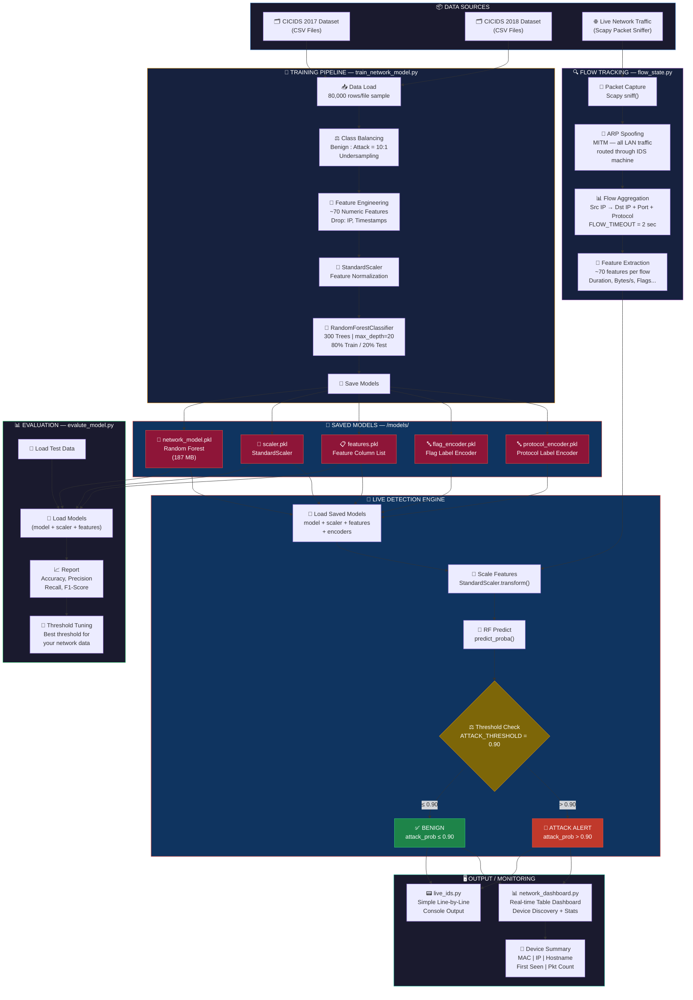
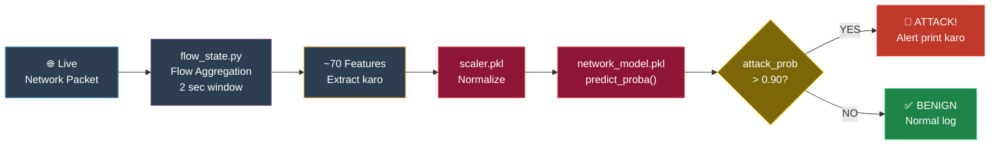
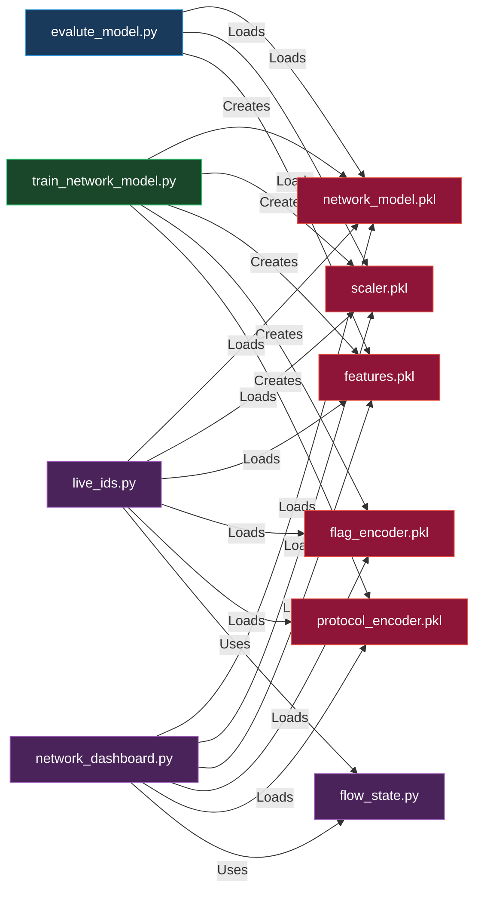

# 🛡️ Network IDS — Complete System Flow Diagram

## 🔄 Poora System Flow (Training + Live Detection)

---

## 📋 Models Ka Role — Quick Summary

| Model File | Type | Kaam |
|---|---|---|
| `network_model.pkl` | RandomForestClassifier (300 trees) | Traffic ko BENIGN/ATTACK classify karta hai |
| `scaler.pkl` | StandardScaler | Features ko normalize karta hai (same range) |
| `features.pkl` | Feature List | Ensure karta hai ki sahi 70 columns use hon |
| `flag_encoder.pkl` | LabelEncoder | TCP flags (SYN, ACK…) ko number mein convert |
| `protocol_encoder.pkl` | LabelEncoder | Protocol (TCP/UDP/ICMP) ko number mein convert |

---

## 🚦 Decision Logic

---

## 🗂️ Script → Model Dependency Map

